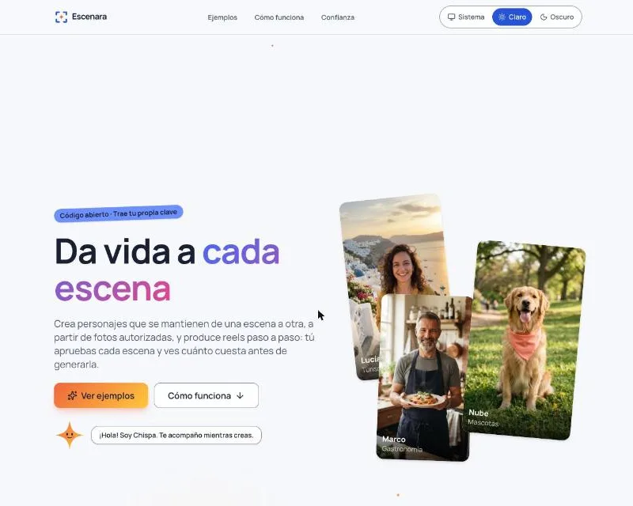
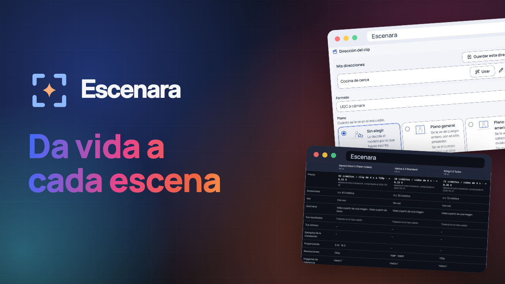

<p align="center">
  
  
</p>

<p align="center"><strong>Da vida a cada escena</strong><br>Estudio abierto de personajes y vídeo</p>

<p align="center">Un proyecto de <a href="https://codeia.dev">codeia.dev</a>, la comunidad de desarrolladores que construyen con inteligencia artificial.</p>

<p align="center">
  <a href="LICENSE"></a>
  
  
</p>

---

**Escenara** es una aplicación web de código abierto para crear un **personaje persistente** a partir de fotos autorizadas de una persona o de un animal (o inventarlo desde cero), y producir con él publicaciones y **vídeos cortos** (Reels, TikTok, Shorts) escena a escena.

- **Trae tus propias claves (BYOK).** Cada persona conecta sus proveedores de IA; Escenara no cobra por la inferencia.
- **Guiado por botones.** Eliges especialidad, formato, estilo, vestuario y duración; todo es editable.
- **Nada se genera sin tu aprobación.** Ves el guion, el plan y el coste estimado antes de gastar, y un fallo del proveedor nunca se reintenta solo.
- **Consentimiento y privacidad primero.** Registro de derechos, sin menores, etiquetado de contenido sintético y borrado completo.

> **Estado: versión base (0.49.3); pruebas reales del propietario pendientes en varias áreas.** El recorrido completo —personaje, guion, escenas, revisión, montaje y exportación— está hecho y cubierto por tests, incluido uno de extremo a extremo con respuestas grabadas del proveedor. Lo que todavía **no se ha probado con dinero real ni a mano en un navegador** incluye la comunidad, «Comparar generando», los lugares con fotos reales y el canto con audio propio (este viene apagado hasta esa prueba). Casi todos los modelos que trae el catálogo solo declaran vídeo vertical 9:16 (el de imagen de fábrica, también): los otros formatos (4:5, 1:1 y 16:9) se sacan sobre todo reencuadrando en el montaje. Las decisiones legales marcadas como provisionales están **pendientes de revisión jurídica** ([Cumplimiento y privacidad](docs/legal/cumplimiento-y-privacidad.md)). El detalle de cada versión está en el [registro de cambios](docs/CHANGELOG.md).

<p align="center">
  
</p>

## Vídeo de presentación

<!-- VIDEO-PRESENTACION -->
<p align="center">
  <a href="https://youtu.be/MEdbVU6bI4Q"></a>
</p>

<p align="center"><a href="https://youtu.be/MEdbVU6bI4Q">Ver el vídeo de presentación en YouTube</a> · 1:28 · con subtítulos</p>

## Qué puedes hacer hoy

Todo se hace desde el navegador. El menú superior tiene una entrada por cada bloque; la guía [Recorrido por el menú](docs/guias/recorrido-por-el-menu.md) explica cada una y qué hay que encender en el panel de administración.

<p align="center">
  
  
</p>

| Bloque | Qué hace | Guías |
|---|---|---|
| **Personajes** | Una persona o un animal con sus fotos y su consentimiento (sin él no se genera), captura guiada con control de calidad local, ficha que viaja en cada prompt y versiones. También personajes **inventados** (sin fotos reales), **animados** y escenas con **dos personajes** (podcast y dualcast) | [Crear un personaje](docs/guias/crear-un-personaje.md), [Personajes inventados](docs/guias/personajes-inventados.md), [Podcast y dualcast](docs/guias/podcast-y-dualcast.md) |
| **Productos** | Lo que enseñas delante de la cámara (físico o una app), con sus fotos por papel; la etiqueta y el envase no se tocan | [Presentar un producto](docs/guias/productos.md) |
| **Lugares** | El sitio poco conocido que reutilizas como escenario, con su foto maestra, sus versiones y su declaración de derechos | [Lugares](docs/guias/lugares.md) |
| **Dirección del clip** | Formato, plano y ángulo, cámara, micro-acción, guion y voz; el método 6C del fotograma; «cambiar solo…» | [Dirigir tu clip](docs/guias/dirigir-tu-clip.md) |
| **Crear y proyectos** | Un clip suelto en «Crear», paso a paso, o un proyecto con brief del anuncio, guion, plan con coste, producción escena a escena, revisión de continuidad, voz y subtítulos | [Tu primer vídeo](docs/guias/tu-primer-video.md), [La estrategia del anuncio](docs/guias/estrategia-del-anuncio.md), [Producir tu proyecto](docs/guias/producir-tu-proyecto.md) |
| **Trends y plantillas** | Formatos virales vigentes y plantillas de la instalación, con su vista previa y su coste; canto con audio propio (apagado de fábrica) | [Usar y administrar trends](docs/guias/trends-virales.md), [Presets y plantillas](docs/guias/presets-y-plantillas.md) |
| **Comparar** | Precios, tus resultados y ejemplos de cada modelo, lado a lado, **sin gastar nada**; y, si lo confirmas, dos modelos animando la misma escena | [Comparar modelos](docs/guias/comparar-modelos.md) |
| **Montaje y exportación** | Línea de tiempo, mezcla, subtítulos, etiqueta de contenido sintético obligatoria y MP4 en 9:16, 4:5, 1:1 y 16:9 sin gastar créditos (con FFmpeg) | [Montar y exportar tu vídeo](docs/guias/montaje-y-exportacion.md), [Formatos y proyectos largos](docs/guias/formatos-y-proyectos-largos.md) |
| **Comunidad** | Galería de la instalación **solo con contenido sintético**, con moderación previa, retos y logros. **Viene apagada**: se enciende en Admin › Ajustes › Comunidad | [Comunidad](docs/guias/comunidad.md) |
| **Tus datos** | Historial y gasto, exportar un proyecto en ZIP sin claves, y borrar un proyecto o la cuenta con periodo de gracia | [Tus datos](docs/guias/tus-datos.md) |
| **Marca** | Tu logotipo en tus exportaciones (kit de marca) y la marca de la instalación: nombre, logotipos, tipografía y colores con contraste comprobado | [Tu kit de marca](docs/guias/tu-kit-de-marca.md), [Personaliza tu instancia](docs/guias/personaliza-tu-instancia.md) |
| **Accesibilidad** | Objetivo WCAG 2.2 AA: contraste, foco visible, todo con el teclado, lector de pantalla y «reducir movimiento»; lo que está comprobado y lo que no | [Accesibilidad](docs/guias/accesibilidad.md) |

Antes de gastar, cada generación dice si está lista, necesita ajustes, requiere revisión o está bloqueada, con el motivo y dónde se arregla ([Por qué no puedo generar](docs/guias/por-que-no-puedo-generar.md)).

## Empezar en local

Requisitos: **[Bun](https://bun.sh) 1.4.2+**, **Docker** con Docker Compose y, para montar y exportar vídeos, **FFmpeg** (con `ffprobe`) en el `PATH`.

```bash
git clone https://github.com/yosnap/escenara.git escenara
cd escenara
cp .env.example .env        # cambia las contraseñas y genera los secretos que indica el archivo
bun install
bun run services:up         # PostgreSQL, SeaweedFS (almacenamiento S3) y Mailpit (correo local)
bun run db:migrate          # crea o actualiza las tablas
bun run dev                 # web en http://localhost:3021 y worker de la cola
```

Comprueba que todo está conectado en <http://localhost:3021/api/health>: debe responder `{"status":"ok","database":"ok","storage":"ok"}`. Después crea tu cuenta en <http://localhost:3021/registro>: la primera es la administradora y los correos de confirmación llegan a Mailpit. Tus claves de API van en **Tu cuenta › Credenciales de IA**, cifradas con la clave maestra del servidor; la configuración de la instalación, en **Admin › Ajustes**. La instalación arranca con el catálogo de modelos, los presets y las plantillas, pero **sin personajes ni proyectos de ejemplo** y con algunas opciones apagadas (la comunidad, el asistente de guion, el canto…): la guía [Recorrido por el menú](docs/guias/recorrido-por-el-menu.md) dice qué hay en cada entrada y dónde se enciende cada cosa.

| Servicio | Dirección local |
|---|---|
| Aplicación web | `http://localhost:3021` |
| Web de documentación | `http://localhost:3022` |
| PostgreSQL | `localhost:5421` |
| SeaweedFS (API S3) | `http://localhost:8321` |
| Mailpit (bandeja de correo local) | `http://localhost:8421` (SMTP en `localhost:1021`) |

Los puertos son fijos. Si alguno está ocupado, libera el proceso que lo usa en lugar de cambiar el puerto (detalles en [CONTRIBUTING.md](CONTRIBUTING.md)).

## Comandos

| Comando | Qué hace |
|---|---|
| `bun run dev` | Arranca la web en el puerto 3021 **y el worker de la cola** |
| `bun run dev:web` / `bun run worker` | Arranca solo la web o solo el worker (útil para verlos por separado) |
| `bun run check` | Lint, tipos, tests y build: lo que debe pasar antes de proponer un cambio |
| `bun run format` | Formatea y ordena imports con Biome |
| `bun run services:up` / `bun run services:down` | Levanta o detiene PostgreSQL, SeaweedFS y Mailpit |
| `bun run db:backup` / `bun run db:migrate` | Copia la base de datos a `backups/bd/` / aplica las migraciones pendientes |
| `bun run db:generate` | Genera una migración SQL a partir de los cambios del esquema |
| `bun run docs:dev` | Arranca la web de documentación en el puerto 3022, leyendo las guías de `docs/guias` |
| `bun run docs:build` / `bun run docs:preview` | Construye la web de documentación en `apps/docs/dist` (y comprueba que no publica nada privado) / la sirve en el 3022 |

## Estructura

```text
apps/web/        Aplicación Next.js sobre Bun (interfaz y API)
apps/docs/       Web de documentación (Astro Starlight) construida desde docs/guias
scripts/         Arranque de desarrollo (web y worker atados)
spikes/          Prototipos y pruebas de modelos, fuera de la aplicación
docs/            Documentación del producto, marca, arquitectura y procesos
docker-compose.yml  Servicios locales
```

## Documentación

- [Mapa de la documentación](docs/README.md) y [guías de uso](docs/guias/) (empieza por el [recorrido por el menú](docs/guias/recorrido-por-el-menu.md))
- Web de las guías: `bun run docs:dev` y abre <http://localhost:3022>. Se publica en `docs.escenara.com` siguiendo [Desplegar la documentación en Easypanel](docs/procesos/desplegar-documentacion-easypanel.md)
- [Visión de arquitectura](docs/arquitectura/vision-arquitectura.md) y [decisiones (ADR)](docs/arquitectura/decisiones/README.md)
- [APIs y proveedores](docs/recursos/apis-y-proveedores.md)
- [Guía de marca](docs/branding/ESCENARA_BRAND_GUIDE.md) y [dirección visual](docs/diseno/direccion-visual-escenario.md)
- [Cumplimiento y privacidad](docs/legal/cumplimiento-y-privacidad.md)
- [Registro de cambios](docs/CHANGELOG.md)

## Contribuir

¡Las contribuciones son bienvenidas! Lee la [guía de contribución](CONTRIBUTING.md) y el [código de conducta](CODE_OF_CONDUCT.md). Para fallos de seguridad, sigue la [política de seguridad](SECURITY.md) y no abras un issue público. Si vas a tocar la documentación o las capturas, la guía de contribución explica cómo comprobarla (`bun run docs:build`) y cómo hacer capturas con datos inventados.

## Licencia

Escenara se publica bajo la [GNU Affero General Public License v3.0](LICENSE). Si ofreces una versión modificada de Escenara como servicio en red, debes poner su código fuente a disposición de quienes la usen. Los modelos, fuentes, música y demás recursos de terceros tienen sus propias licencias.
