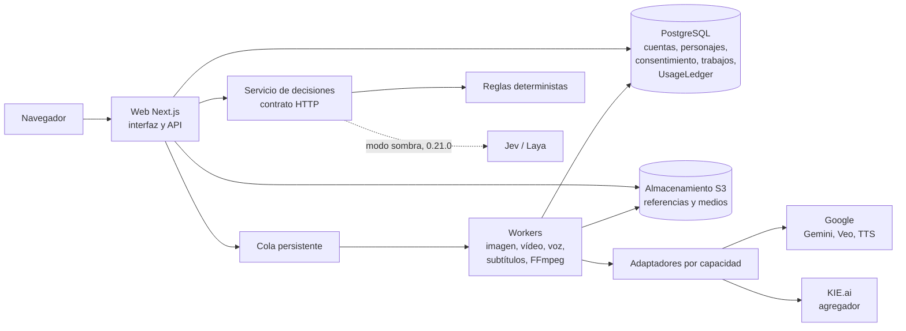

# Visión de arquitectura

**Estado:** propuesta; las piezas marcadas como pendientes dependen de los ADR de `decisiones/README.md` · **Base:** PRD 0.5, secciones 6 y 7

## Componentes

- **Web:** Next.js con la interfaz (capa Escenario y zonas de claridad) y la API con autorización por usuario y proyecto.
- **Cola y workers:** trabajos asíncronos idempotentes con estado persistido; FFmpeg para montaje y subtítulos.
- **Adaptadores:** contrato por capacidades del PRD: `image_edit`, `image_to_video`, `text_to_video`, `tts`, `speech_to_text`, `multimodal_review`, más `text_generation` para guion y storyboard (hueco detectado en el PRD).
- **Decisiones:** reglas deterministas para precio, consentimiento, límites técnicos y políticas. Jev o Laya se incorporan detrás del mismo contrato, primero en modo sombra.
- **Secretos:** credenciales BYOK cifradas en servidor (cifrado de sobre con clave maestra del operador); nunca vuelven íntegras al navegador ni a los logs.

## Flujo de generación «fotograma clave primero»

1. El asistente produce guion y storyboard (`text_generation`) y el usuario los aprueba.
2. Los controles previos comprueban credenciales, capacidades, consentimiento y presupuesto (RF12).
3. Se reserva de forma atómica el coste máximo estimado (RF14).
4. Se genera una **imagen fija por escena** con las referencias del personaje (`image_edit`) y el usuario la aprueba.
5. Se anima la imagen aprobada (`image_to_video`).
6. La voz se genera aparte con TTS y la misma voz para todo el proyecto; la sincronía labial es opcional.
7. Revisión de continuidad y humana (RF07); se acepta, corrige o regenera **solo** la escena afectada.
8. Montaje, subtítulos, etiqueta de contenido sintético y exportación (RF08).

## Entidades del PRD

`User`, `ProviderCredential`, `Character`, `ConsentRecord`, `ReferenceAsset`, `CharacterVersion`, `PromptTemplate`, `Project`, `Scene`, `GenerationJob`, `ReviewResult`, `Export` y `UsageLedger`. Se añadirán `ModelCatalogEntry` (registro de modelos con estado y fecha de precio) y `DecisionRecord` (decisión, evidencia, umbral, versión de reglas y corrección humana) cuando se implementen 0.8.0 y 0.21.0.

## Pila propuesta

| Pieza | Propuesta | Estado |
|---|---|---|
| Lenguaje del MVP | TypeScript único; Python cuando Laya o LangGraph aporten valor medido | Pendiente, ADR-0002 |
| Web y API | Next.js (App Router) | Propuesta del PRD |
| Base de datos | PostgreSQL | Decidido en el PRD |
| Cola | pg-boss (solo Postgres) o BullMQ (Redis) | Pendiente, ADR-0003 |
| Autenticación | Better Auth o Auth.js | Pendiente, ADR-0004 |
| Cifrado de credenciales | AES-256-GCM con cifrado de sobre y clave maestra en el entorno o gestor de secretos | Pendiente, ADR-0005 |
| Almacenamiento | MinIO en local; Cloudflare R2 o S3 en producción | Pendiente, ADR-0006 |
| Despliegue | Docker Compose en local; Easypanel para la instancia del proyecto | Decidido: Easypanel (ADR-0007) |
| Montaje | FFmpeg en workers | Pendiente, ADR-0008 |
| Modelos iniciales | Según el informe de 0.3.0 | Pendiente, ADR-0009 |

## Principios

- Ninguna generación se envía sin aprobación, sin presupuesto reservado o con una regla obligatoria fallida.
- Sin reintentos de pago automáticos; tras un timeout se consulta el estado antes de reenviar.
- Todo lo que se genera guarda proveedor, modelo, versión de plantilla, consentimiento y coste comunicado.
- Los adaptadores se prueban con pruebas de contrato; añadir un modelo al catálogo no lo habilita automáticamente.
- Validación de URLs externas contra SSRF y límites de uso por cuenta.
