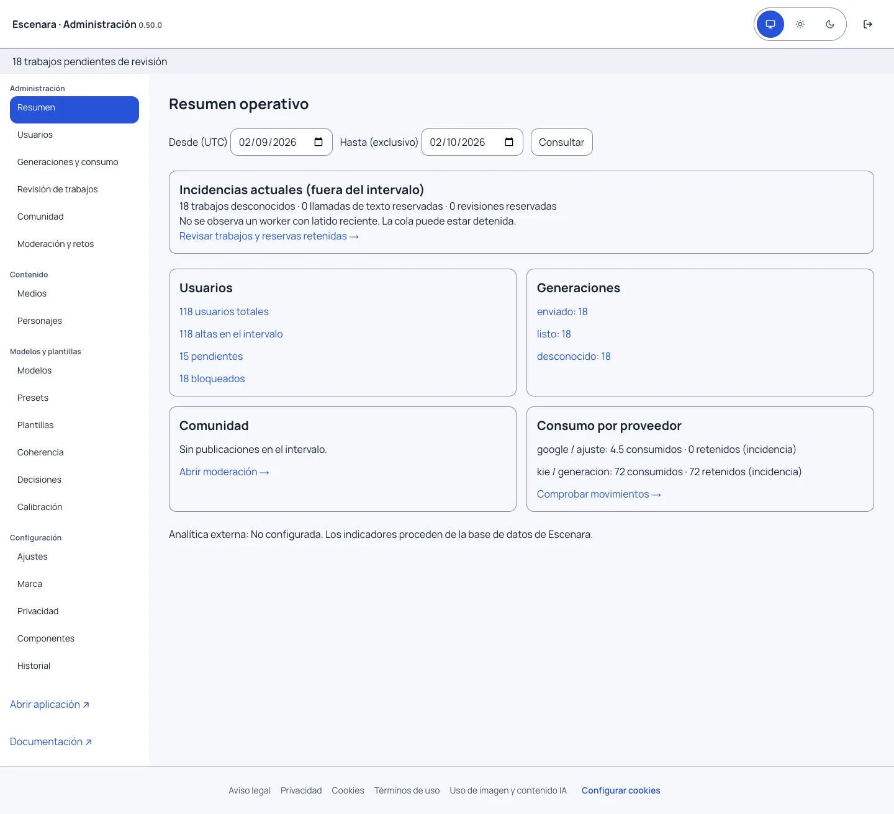
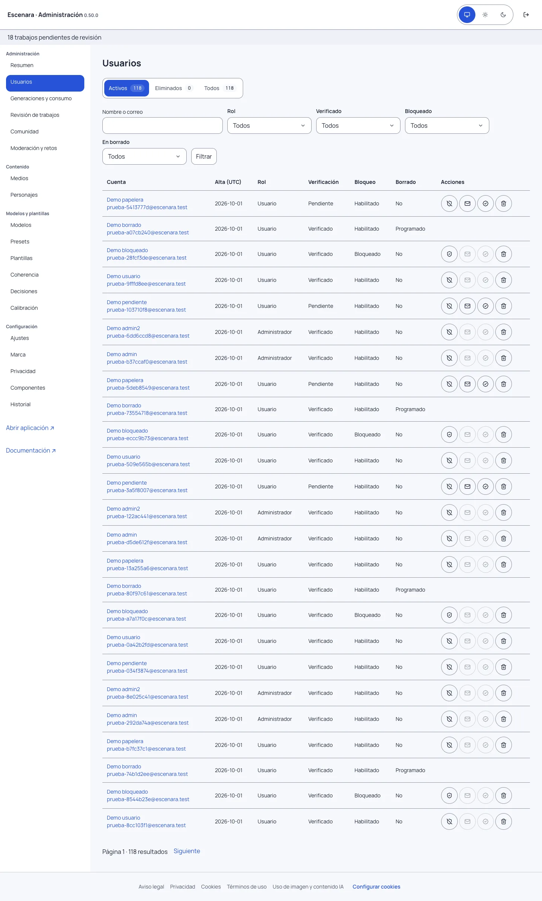
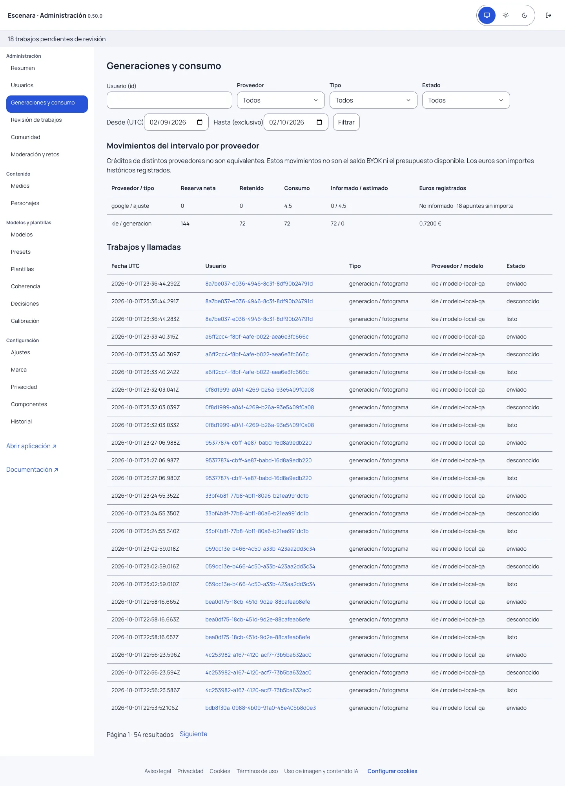

# Administrar la instalación

Desde **Admin** entras en `/admin`, un espacio reservado a cuentas administradoras. La cabecera muestra la versión,
el tema y la salida; el lateral reúne las herramientas. En móvil, **Menú de administración** abre el menú, y Escape
lo cierra devolviendo el foco al botón. **Abrir aplicación ↗** y **Documentación ↗** abren otra pestaña.

## Resumen operativo

El intervalo usa días UTC: **Desde** incluye ese día y **Hasta** lo excluye. Admite de 1 a 366 días; inicialmente
muestra los últimos 30. Los enlaces llevan a las listas que permiten comprobar las cifras.

Usuarios totales, pendientes y bloqueados describen el estado actual; las altas corresponden al intervalo.
Generaciones y publicaciones se agrupan por su fecha de creación. **Incidencias actuales** queda fuera del intervalo:
muestra trabajos desconocidos, llamadas de texto y revisiones reservadas, y workers con latido reciente.
La ausencia de latido advierte de una posible cola detenida. Un error de consulta se muestra como error.

## Usuarios y acciones

Busca por nombre o correo y combina rol, verificación, bloqueo y borrado. Las listas muestran 25 resultados por
página con orden estable. La ficha conserva los filtros al volver y enlaza al consumo de esa cuenta.
Las vistas **Activos**, **Eliminados** y **Todos** muestran contadores que respetan los filtros y conservan la
búsqueda al cambiar de vista. Los selectores son amplios y muestran una flecha para abrir sus opciones.
Cada fila ofrece iconos de **Deshabilitar/Habilitar**, **Reenviar verificación**, **Verificar correo** y **Eliminar**,
con ayuda al pasar el ratón o enfocar con el teclado. Las acciones requieren confirmación y motivo.
Si el correo ya está verificado, los dos iconos de verificación quedan desactivados y la ayuda explica el motivo.
Para verificar una cuenta bloqueada, primero debes habilitarla.

Cada acción exige confirmar el destinatario y escribir un motivo de 3 a 300 caracteres, sin datos privados:

- **Activar manualmente** marca el correo como verificado; úsalo cuando hayas comprobado la identidad por tu procedimiento.
- **Reenviar activación** genera el enlace auténtico de verificación, válido 24 horas. Se permite una solicitud por
  minuto para el actor o el destinatario. No se reenvía automáticamente al repetir la misma operación.
- **Bloquear** revoca las sesiones y detiene nuevos accesos y reservas. Los trabajos que aún no han cruzado la
  frontera de envío no llegan al proveedor. Los ya enviados o inciertos siguen conciliándose: conservan su gasto.
- **Desbloquear** permite volver a acceder; no recupera sesiones revocadas ni cancela un borrado programado.
- **Revocar sesiones** exige volver a identificarse, sin bloquear la cuenta.

No puedes bloquearte ni dejar la instalación sin administradores habilitados. Las cuentas en borrado conservan
su flujo y plazo de recuperación; no se activan, bloquean ni desbloquean desde este panel.

**Eliminar** en el listado y **Enviar a eliminados** en la ficha realizan un borrado lógico: conservan la cuenta y sus datos, deshabilitan el acceso y revocan
las sesiones. La lista **Activos** la oculta; **Eliminados** permite **Restaurar** o **Eliminar definitivamente**.
Restaurar conserva el bloqueo que existía antes y exige iniciar una sesión nueva. La papelera no caduca automáticamente.
El borrado definitivo requiere que termine el plazo de recuperación configurado y una confirmación adicional.
Entonces el worker existente concilia trabajos y costes, limpia los archivos y elimina la cuenta. Si encuentra trabajos
en curso o un fallo de almacenamiento, mantiene el proceso pendiente y lo reintenta. No puedes eliminarte desde el panel
ni dejar la instalación sin administradores habilitados.

La ficha muestra los últimos 25 reenvíos y 50 eventos administrativos. **Aceptado** solo prueba aceptación SMTP,
sin confirmación de entrega; **fallido** corresponde a un rechazo observado; **incierto** o una solicitud sin cierre
exigen comprobar el transporte antes de repetir. Tokens, enlaces, cuerpos de correo y credenciales quedan fuera del historial.

## Generaciones, consumo y límites

Filtra por cuenta, proveedor, tipo, estado y fechas. El contador cuenta entidades, no apuntes de contabilidad:
generaciones, asistente, traducciones y revisiones multimodales. No se enseñan prompts ni archivos privados.

Los movimientos del periodo separan créditos reservados, retenidos por incidencias y consumidos, con su parte
informada o estimada. Los euros son los registrados en cada apunte; un importe sin informar no es cero confirmado.
No se recalculan datos históricos con tarifas nuevas. Los ajustes sin llamada asociada aparecen separados.

En la ficha puedes elegir **Heredar**, **Sin tope** o **Límite** positivo para presupuesto y coste por trabajo.
El cero global conserva su significado de ausencia de tope. La comprobación y la reserva usan el mismo bloqueo
de cuenta: un cambio concurrente no permite gastar con una política obsoleta.

Es un **tope interno de la aplicación**, no el saldo BYOK del proveedor. La política histórica agrega unidades
internas: los créditos de proveedores diferentes no son equivalentes ni comparables. Reducir un límite por debajo
del gasto comprometido deja disponibilidad cero para nuevas llamadas; conserva gastos, reservas y llamadas iniciadas.
Para resolver desconocidos, entra en **Trabajos** y usa su revisión existente.

## Comunidad y configuración

**Comunidad** muestra publicaciones pendientes, aprobadas o rechazadas y autores distintos del intervalo.
Los enlaces abren la moderación existente: quien administra no puede aprobar su propia publicación.
Medios, personajes, modelos, presets, plantillas, marca y demás herramientas conservan sus URLs.
En **Componentes**, cada sección del menú tiene una página `/admin/componentes/<sección>`.
Cada página muestra solo las demostraciones de la sección elegida. En móvil el índice se despliega
con **Elegir sección**, para mantener la página manejable.

**Ajustes** agrupa acceso/correo, generación/presupuesto, almacenamiento/datos, comunidad y privacidad/legal.
Guardar aplica solo los cambios del grupo visible y mantiene pendientes los de otros grupos. Un conflicto con
otro administrador pide recargar. Las credenciales se guardan o retiran de forma explícita, con revisión de su versión,
y la auditoría registra claves cambiadas, sin valores secretos. El correo de prueba solo sale al pulsar su botón.

## Privacidad y retención

**Privacidad** inventaría cookies de autenticación y almacenamiento técnico, finalidad y duración. El aviso
**Entendido** recuerda la lectura; no autoriza servicios opcionales. Analítica figura **No configurada** y no hace
solicitudes a proveedores analíticos. El resumen consulta datos operativos de la propia base de datos.

Los plazos de auditoría y correo de **Privacidad y legal** organizan la revisión manual: cero significa sin plazo
fijado; no hay borrado automático por vencimiento. Define los plazos y el procedimiento según tu instalación.
Al eliminar una cuenta se eliminan su política y eventos de correo y se minimizan motivos/cambios de auditoría vinculados.
Solo administradores vigentes leen estos datos. Completa también el titular y los textos de tu instalación.

Las capturas usan exclusivamente datos ficticios de una BD local aislada. Esta versión no añade gestión de roles,
suplantación, borrado directo de cuentas ni proveedor de analítica.
