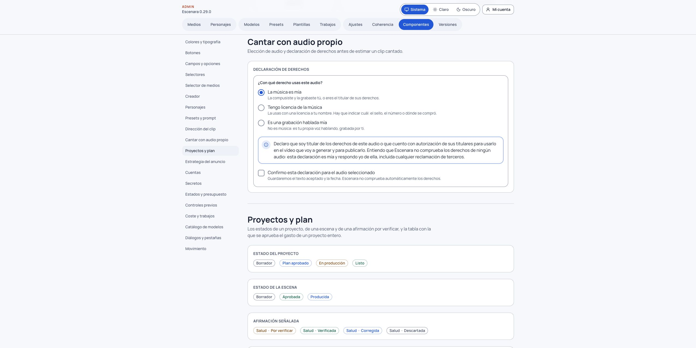
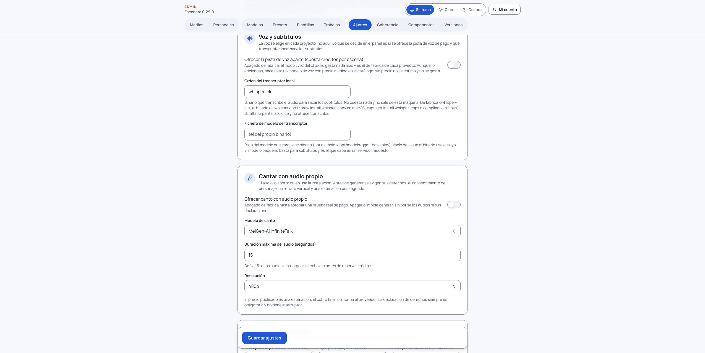

# Cantar con tu audio

Una escena de canto mueve los labios de tu personaje siguiendo **tu archivo de audio**. Puede contener música o voz hablada. Escenara no crea la canción ni cambia la voz grabada.

1. En la dirección de la escena, elige el formato «Cantar con tu audio» (después aparece el panel «Cantar o hablar con tu audio») y un personaje con retrato **vertical**. Si es una persona real, su consentimiento para imagen y voz debe seguir vigente.
2. Sube un MP3, WAV, OGG, M4A o AAC, o elige uno de tu biblioteca. El límite inicial es **15 segundos**. Si dura más, recórtalo y vuelve a subirlo. La duración se mide en el servidor antes de ofrecer el coste.
3. Declara los derechos del archivo. Elige **música propia**, **música con licencia** e indica su referencia, o **audio hablado propio**. Lee y acepta el texto mostrado. Escenara registra la fecha y la IP; no comprueba automáticamente quién posee los derechos.
4. Elige plano, ángulo y cámara en «Dirección del clip» y describe lo que se ve. Esas elecciones se guardan con la escena y se incorporan al encargo; la pista de audio decide las notas y el ritmo. Revisa el retrato, los impedimentos y la estimación. La cifra se calcula con los segundos facturables y el precio publicado para el modelo y la resolución configurados. Aprueba la escena y el plan. En Producción, confirma el importe exacto antes de generar.

Si cambias el audio, la aprobación anterior deja de valer y tendrás que revisar el plan y el coste. Si un intento falla y pudo cobrarse, autoriza un reintento antes de volver a confirmar. Los errores indican qué falta y si se ha reservado o cobrado algo.

La función parte apagada en una instalación nueva. Quien administra puede activarla y configurar modelo,
duración máxima y resolución en **Admin › Ajustes › Cantar con audio propio**. También debe sincronizar el catálogo de precios
en **Admin › Modelos**: si falta la tarifa exacta de los segundos y la resolución elegidos, Escenara bloquea
la generación antes de reservar créditos.

## Qué esperar del resultado

Trátala como una función **experimental**. En las pruebas con dos canciones, el flujo técnico funcionó de principio a fin
(subida, derechos, coste, generación y montaje), pero **los labios no siguieron el sonido con la claridad que se
esperaba** y la sincronía del canto no quedó validada. Además, el proveedor puede añadir un fondo o un texto que no
pediste, aunque escribas un fondo liso sin rótulos. Como referencia de coste, un clip de unos 12 s con Kling AI Avatar
Standard a 720p se estimó en 96 créditos. Trata ese importe como una
medida, no como un precio garantizado: el plan de la escena muestra siempre el coste vigente antes de generar.

