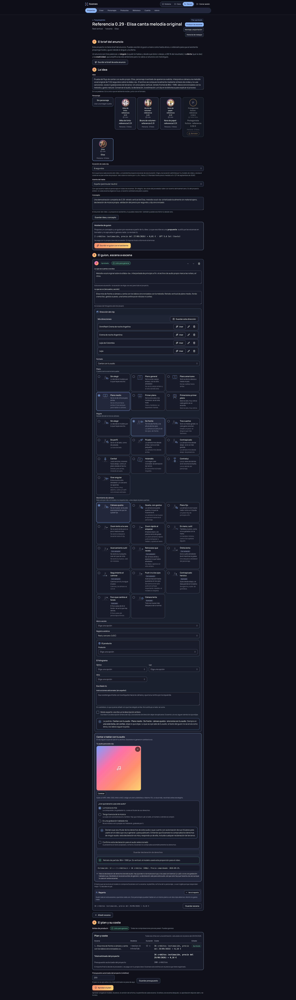

# Cantar con tu audio

Una escena de canto mueve los labios de tu personaje siguiendo **tu archivo de audio**. Puede contener música o voz hablada. Escenara no crea la canción ni cambia la voz grabada.

1. En la dirección de la escena, elige el formato «Cantar con tu audio» (después aparece el panel «Cantar o hablar con tu audio») y un personaje con retrato **vertical**. Si es una persona real, su consentimiento para imagen y voz debe seguir vigente.
2. Sube un MP3, WAV, OGG, M4A o AAC, o elige uno de tu biblioteca. El límite inicial es **15 segundos**. Si dura más, recórtalo y vuelve a subirlo. La duración se mide en el servidor antes de ofrecer el coste.
3. Declara los derechos del archivo. Elige **música propia**, **música con licencia** e indica su referencia, o **audio hablado propio**. Lee y acepta el texto mostrado. Escenara registra la fecha y la IP; no comprueba automáticamente quién posee los derechos.
4. Elige plano, ángulo y cámara en «Dirección del clip» y describe lo que se ve. Esas elecciones se guardan con la escena y se incorporan al encargo; la pista de audio decide las notas y el ritmo. Revisa el retrato, los impedimentos y la estimación. La cifra se calcula con los segundos facturables y el precio publicado para el modelo y la resolución configurados. Aprueba la escena y el plan. En Producción, confirma el importe exacto antes de generar.

Si cambias el audio, la aprobación anterior deja de valer y tendrás que revisar el plan y el coste. Si un intento falla y pudo cobrarse, autoriza un reintento antes de volver a confirmar. Los errores indican qué falta y si se ha reservado o cobrado algo.

La función parte apagada en una instalación nueva. Quien administra puede activarla y configurar modelo,
duración máxima y resolución en **Admin › Ajustes › Cantar con audio propio**. También debe sincronizar el catálogo de precios
en **Admin › Modelos**: si falta la tarifa exacta de los segundos y la resolución elegidos, Escenara bloquea
la generación antes de reservar créditos. El enlace [Elisa canta una melodía original](/proyectos/11bf3d6d-2470-4a58-886c-0f6654c3c37d)
abre un proyecto de prueba de la cuenta administradora. Su [audio sintetizado](../assets/audio/0.29.0-melodia-original-la.mp3)
dura 11,52 s, pero no contiene una voz cantada claramente reconocible. Dos intentos con InfiniteTalk fallaron
sin cobro; Kling AI Avatar Standard a 720p estimó 96 créditos por 12 s y KIE informó **88 créditos consumidos**.
El clip fuente es vertical de 848 × 1072, no 9:16; el montaje guardado sí mide 1080 × 1920 y conserva el
encuadre con franjas negras. **El propietario comprobó que los labios no siguen el sonido:** este resultado
demuestra el flujo técnico, no la calidad de sincronía del canto. La [guía de recorridos](recorridos-de-referencia-0.29-0.32.md)
conserva entradas, capturas y problemas observados.

La [segunda escena generada con Elisa](/proyectos/57498e74-3b24-452b-85ab-17e93ece79b7) usa una canción
que el propietario confirmó como composición y grabación originales de su estudio. El audio completo y el
recorte de 12 s se conservan en la biblioteca; la escena guarda el plano frontal y la declaración de música
propia. Kling consumió **96 créditos** más, **184 de 200** entre ambos intentos. Su
[clip](../assets/capturas/0.29.0-elisa-voz-clip-listo.png) y su
[montaje etiquetado](../assets/capturas/0.29.0-elisa-voz-montaje-listo.png) quedaron guardados y el MP4
exportado mide 1080 × 1920 con audio. El proveedor añadió fondo de cafetería y texto ilegible aunque se pidió
un fondo liso sin rótulos. Falta que el propietario confirme si la boca sigue perceptiblemente el canto; no se
debe presentar todavía como ejemplo de sincronía validada.

