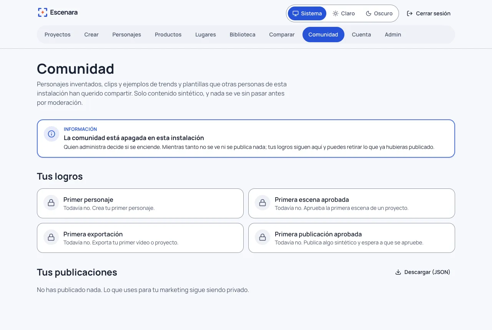
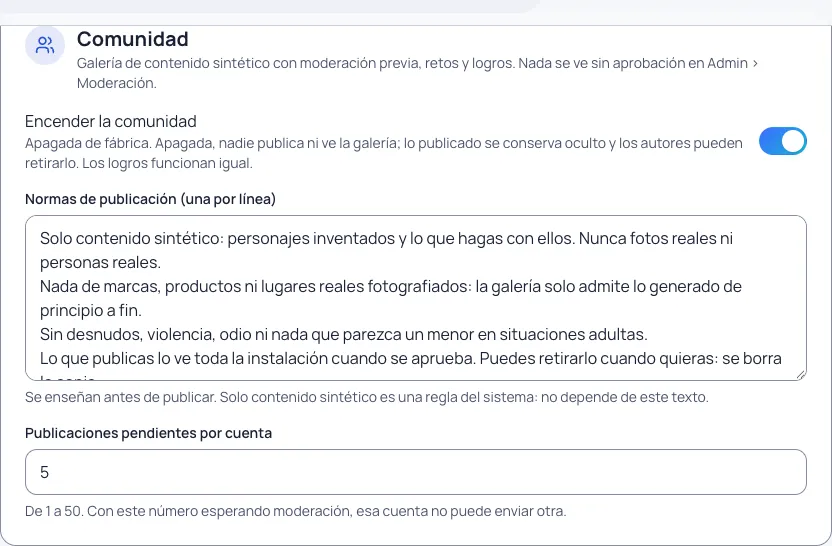
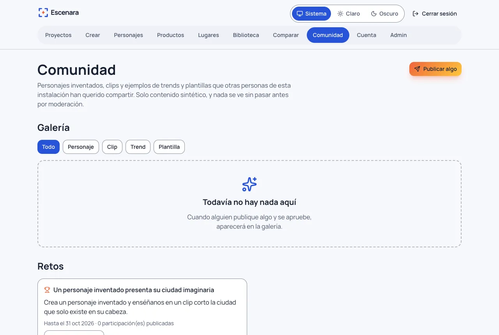
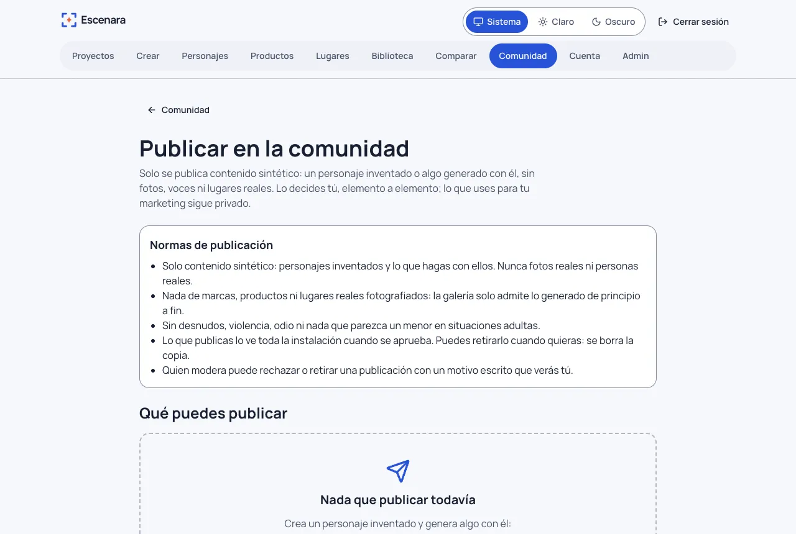
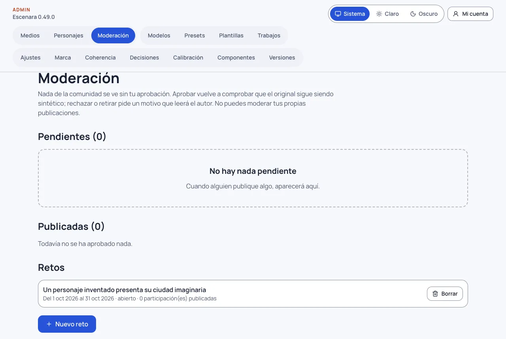
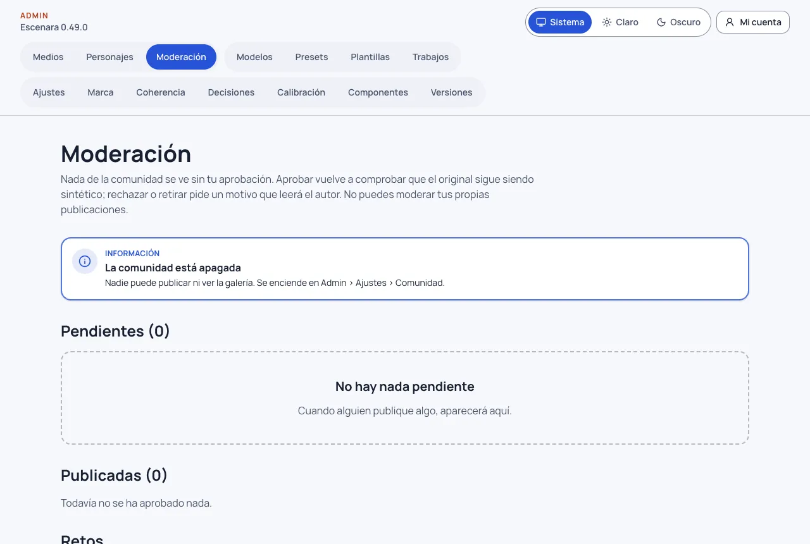

# Comunidad: publicar, moderar, retos y logros

La comunidad es una galería de la propia instalación donde cada persona puede enseñar lo que ha hecho **con personajes
inventados**. Tiene tres reglas que no dependen de ningún ajuste:

1. **Solo contenido sintético.** Personajes inventados, clips e imágenes generados con ellos, y ejemplos de trends y
   plantillas hechos así. **Nunca** una foto real, un personaje hecho con fotos reales (persona o mascota) ni nada donde
   pueda salir una persona real.
2. **Tú decides cada elemento.** Nada se publica solo. Lo que usas para tu marketing (tu avatar, tus clips con
   producto) sigue siendo privado. Si quieres enseñar la plataforma, crea un personaje inventado solo para eso y publica
   ese.
3. **Nada se ve sin moderación.** Lo que publicas lo revisa una persona con rol de administrador antes de que nadie más
   lo vea. Y nadie aprueba lo suyo.

No hay comentarios, seguidores, mensajes ni publicación automática en redes.

## Cómo se llega y cómo se enciende

Se entra por **Comunidad**, en el menú superior de la aplicación (entre «Comparar» y «Cuenta»). La entrada está
siempre, pero la comunidad viene **apagada de fábrica**: mientras lo esté, la página solo enseña el aviso «La
comunidad está apagada en esta instalación», **tus logros** y **tus publicaciones** (para que puedas retirar lo que
ya hubieras publicado). No se ve la galería ni se puede publicar nada.



Para encenderla, alguien con rol de administrador:

1. Abre **Admin › Ajustes** y baja hasta la sección **Comunidad**.
2. Activa **«Encender la comunidad»**. Si quieres, ajusta las **normas de publicación** (una por línea) y cuántas
   publicaciones **pendientes** puede tener cada cuenta (5 de fábrica, de 1 a 50).
3. Pulsa **Guardar ajustes**. Desde ese momento aparecen la galería, los retos y el botón **«Publicar algo»**.



Antes de encenderla, asegúrate de que alguien puede **moderar** (ver [Qué hace falta para
moderar](#qué-hace-falta-para-moderar)): nada se ve sin aprobación, así que sin moderación la galería se queda vacía.
Apagarla otra vez no borra nada: lo publicado se conserva oculto y sus autores pueden retirarlo.



## Qué se puede publicar y qué no

Escenara comprueba **de dónde sale** cada cosa por una lista blanca: solo vale lo que es generado de principio a fin.
Para un clip o una imagen mira **todo lo que se envió al proveedor al generarlo** (cada imagen de referencia, no solo la
primera, el fotograma de partida, el audio), tal como quedó guardado en ese momento, y hace lo mismo con cada una de
esas imágenes hacia atrás. Cambiar después la escena (quitar una referencia, el audio de canto) no cambia el veredicto.
Ante la duda, no se publica, y siempre te dice por qué.

| Se puede publicar | No se puede publicar |
|---|---|
| Un personaje **inventado**, con su declaración vigente, cuando ya tiene retrato o vistas generadas | Un personaje hecho con fotos (una persona o una mascota real), o un inventado con alguna imagen que no generó la plataforma (también una subida marcada «hecha con IA») |
| Un clip o una imagen **generados** con un personaje inventado | Una subida tuya (aunque sea una ilustración): no hay forma de saber qué hay en ella |
| Un clip animado desde un fotograma que también generó un inventado | Un clip o un fotograma que envió una foto subida en **cualquiera** de sus referencias, o un fotograma de una persona real |
| | Algo que envió una imagen que ya se borró: no se puede comprobar de dónde salía |
| Un clip en un lugar **generado** (sin fotos) | Un clip en un lugar con fotos (o en uno que ya se borró) |
| | Un clip con producto: sus fotos son subidas |
| | Un clip de un reparto de dos personajes, de un podcast, o cantado con tu audio (aunque después quites el audio de la escena) |
| Un clip hablado con una voz de la instalación | Un clip que envió un audio subido, o un audio: podría ser una voz real |
| Un clip hablado (Omni) con identidad registrada, si el registro subió imágenes generadas de tu inventado | Un clip Omni cuyo registro subió una imagen no generada aquí (aunque luego la quites de la ficha), o sin registro que lo explique |

Lo que se publica es **una copia**: el título, la descripción y la firma que escribes, y una copia del archivo (en un
personaje, su retrato y hasta tres vistas generadas; nunca su hoja 3×3). **Nunca** viaja el prompt, el modelo con el que
se hizo, tu correo, el nombre de tu cuenta, el original ni el texto alternativo que hayas escrito en la biblioteca (la
galería pone uno propio con el título).

## Publicar

1. Abre **Comunidad › Publicar algo**. Verás tus personajes y tus últimos resultados, cada uno con «Publicar» o con el
   motivo por el que no se puede. También llegas desde la ficha de un personaje y desde el historial de **Crear**
   («Publicar en la comunidad»).
2. Lee las **normas de publicación** de tu instalación (arriba de la página). Si todavía no tienes nada
   publicable, la lista lo dice: crea un personaje inventado y genera algo con él.
3. Rellena el título, la descripción (opcional, sin nombres de personas reales) y la **firma**: el nombre con el que
   apareces; no tiene que ser el de tu cuenta.
4. Si el clip se hizo con un trend o una plantilla de la instalación, elige si lo publicas como **clip** o como
   **ejemplo de ese trend o plantilla** (entonces otras personas podrán usarlo, ver más abajo).
5. Si hay un **reto** abierto, puedes participar con esta publicación.
6. Marca la declaración: «Confirmo que es contenido sintético (sin fotos, voces ni lugares reales de ninguna persona) y
   quiero publicarlo en la comunidad». Sin ella no se envía nada. Se guarda con su texto y la fecha.
7. **Enviar a moderación.** Queda «Pendiente de moderación» y solo la ves tú (y quien modera).



Publicar dos veces lo mismo no crea otra publicación: te lleva a la que ya tienes. Cada cuenta puede tener a la vez un
número limitado de publicaciones pendientes (cinco de fábrica).

## Tus publicaciones

En **Comunidad › Tus publicaciones** ves cada una con su estado: **pendiente**, **publicada** o **rechazada**, y en ese
caso el **motivo** que escribió quien modera.

- **Editar** (título, descripción, firma): la publicación **vuelve a moderación** y deja de verse hasta que se apruebe
  otra vez.
- **Retirar**: se borra la publicación y su copia, de verdad. Tu original (el personaje o el archivo) no cambia.
- Si se **rechaza**, su copia se borra enseguida y solo queda el motivo. **Editar** una rechazada es corregirla y volver
  a enviarla: se comprueba otra vez y se vuelve a copiar del original.
- **Descargar (JSON)**: todas tus publicaciones, con su estado y su motivo, y tus logros. También puedes descargarlo
  durante el periodo de gracia del borrado de tu cuenta, y el ZIP de un proyecto lleva `comunidad.json` con las
  publicaciones que salen de él.

Si **borras el original** (el personaje, el archivo o el proyecto del que salió), su publicación deja de verse al
momento y se borra con su copia en unos minutos. Si lo mueves a la **papelera**, deja de verse mientras esté allí
(restaurarlo la vuelve a enseñar). Si **revocas la declaración** de personaje inventado, lo que salió de él deja de
verse para siempre: una declaración revocada no se recupera. En **Tus publicaciones** esas publicaciones salen como
**«Oculta»**, con el motivo (en lugar de «Publicada»), y puedes retirarlas. Si **borras tu cuenta**, tus publicaciones dejan de verse desde que lo
pides y se borran con todo lo demás al terminar el periodo de gracia (ver [Tus datos](tus-datos.md)).

## Ver, usar e inspirarte

La **galería** se filtra por tipo (personajes, clips, trends, plantillas) y por reto. Cada tarjeta dice «Contenido
sintético». Los clips no arrancan solos.

- **Usar este trend (o plantilla)**: abre **Crear** con ese trend o plantilla de la instalación ya elegido y un aviso
  de a quién se lo debes. No copia ningún archivo ni ningún texto de prompt, y **no gasta nada** hasta que tú
  confirmes una generación como siempre. Lo que hagas es tuyo y privado. Cuenta como un uso (uno por persona).
- **Inspirarte en un personaje**: abre el alta de un personaje inventado con la descripción que escribió su autor.
  Cámbiala a tu gusto: el tuyo tendrá sus propios retratos. Sus imágenes nunca se copian.
- Un **clip** solo se ve: no se descarga ni se «usa».

## Retos

Quien administra crea retos en **Admin › Moderación › Retos › «Nuevo reto»**, con un título, un periodo, una
descripción opcional y, si quiere, un trend o una plantilla sugeridos («Crear con…»). Los retos abiertos se ven en la
comunidad debajo de la galería.


Participar es publicar eligiendo el reto: la participación pasa por la **misma moderación** y solo cuenta cuando se
aprueba. Un reto cerrado ya no admite participaciones.

## Logros

Los logros celebran **hitos reales**, una sola vez y con su fecha: tu primer personaje, tu primera escena aprobada, tu
primera exportación y tu primera publicación aprobada. No hay rachas ni cuentas atrás. Al conseguir uno, la comunidad
lo celebra con un confeti de chispas (que no aparece si tienes activado «reducir movimiento») y nunca en una pantalla
de coste o de consentimiento.

## Para quien administra: moderar

### Qué hace falta para moderar

- **La comunidad encendida** (Admin › Ajustes › Comunidad). Apagada, Admin › Moderación lo avisa y no hay nada que
  revisar.
- **Una cuenta con rol de administrador.** Moderar está en **Admin › Moderación** (grupo «Contenido» del menú de
  administración), y solo lo ve quien administra.
- **Un segundo administrador**, si quien administra también publica: nadie puede aprobar lo suyo. La primera cuenta
  que se crea en la instalación es la administradora; hoy **no hay pantalla** para dar ese rol a otra cuenta. Se hace
  en la base de datos, con una copia hecha antes (`bun run db:backup`) y sobre una cuenta ya registrada:

  ```sql
  update users set role = 'admin' where email = 'correo-de-la-otra-persona@ejemplo.com';
  ```

  Si esa persona tenía la sesión abierta, que salga y vuelva a entrar: entonces ve la entrada **Admin** en el menú. Con un solo administrador, lo que publica
  esa persona se queda pendiente para siempre; lo que publican los demás sí se puede moderar.



### La cola de moderación

**Admin › Moderación** tiene la cola de pendientes, de la más antigua a la más nueva, con la vista previa completa, la
elegibilidad **comprobada otra vez** en ese momento (con la misma regla que al publicar) y la **procedencia**: cada cosa
que se envió al generarlo, paso a paso, con su origen (generada con qué personaje, subida, ya borrada). En un personaje,
cada una de sus referencias con su origen real.

- **Aprobar**: la publica. Si el original ya no es sintético (por ejemplo, se añadió una persona real a su escena) no
  se puede aprobar y se dice por qué.
- **Rechazar** o, si ya estaba publicada, **Retirar de la galería**: pide un **motivo escrito** (de 10 a 500
  caracteres). Es lo que leerá el autor: di qué norma incumple y qué puede cambiar. La copia se borra en ese momento.
- Lo aprobado no se vuelve a comprobar entero en cada visita (lo que se generó ya no cambia), pero deja de verse al
  momento si su original se borra o pasa a la papelera, si se revoca la declaración de su personaje o si la cuenta del
  autor entra en borrado. En la lista de publicadas aparece entonces como «Oculta», con el motivo.
- **No puedes moderar lo tuyo**: tus publicaciones tiene que revisarlas otra persona con rol de administrador. En una
  instalación con un solo administrador, lo que publique esa persona se queda pendiente.
- Se decide sobre **la versión que ves**: si el autor la edita mientras la miras, tu decisión no se aplica y te lo dice.

En **Admin › Ajustes › Comunidad** están el interruptor (apagado de fábrica), las **normas de publicación** que se
enseñan al publicar (una por línea) y cuántas publicaciones pendientes puede tener cada cuenta. Las normas son
orientación para las personas: la regla de «solo contenido sintético» la aplica el sistema y no depende de ese texto.

### Normas de publicación de fábrica

- Solo contenido sintético: personajes inventados y lo que hagas con ellos. Nunca fotos reales ni personas reales.
- Nada de marcas, productos ni lugares reales fotografiados: la galería solo admite lo generado de principio a fin.
- Sin desnudos, violencia, odio ni nada que parezca un menor en situaciones adultas.
- Lo que publicas lo ve toda la instalación cuando se aprueba. Puedes retirarlo cuando quieras: se borra la copia.
- Quien modera puede rechazar o retirar una publicación con un motivo escrito que verás tú.

## Privacidad

- Los archivos publicados se sirven **solo** por una ruta de la comunidad y solo si la publicación está aprobada y
  vigente (o a su autor y a quien modera). Nunca se entrega el original ni una dirección del almacenamiento.
- La galería se ve con sesión iniciada en la instalación; no es pública en internet.
- Lo que aparece de ti es lo que escribes (título, descripción, firma) y la copia que eliges publicar.
