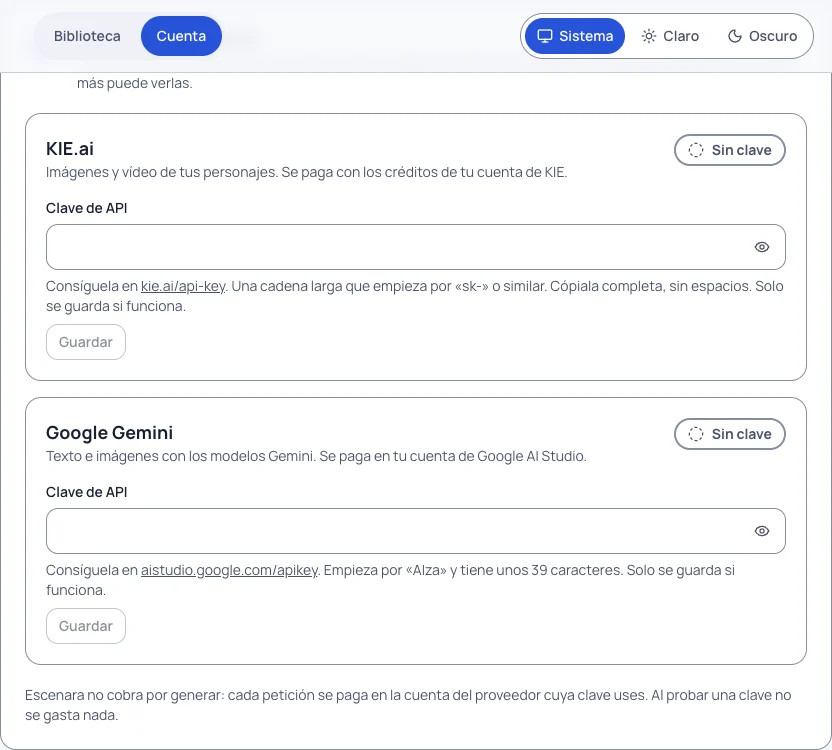

# Configurar la API de cada proveedor

**Versión:** 0.32.1 · **Para:** quien administra una instalación de Escenara y quien la usa con sus propias claves

Escenara no cobra por generar. Cada petición se paga **en la cuenta del proveedor cuya clave se usa**, y hay dos
tipos de claves que conviene no mezclar:

| De quién es | Dónde se guarda | Para qué |
|---|---|---|
| **De cada usuario** | «Tu cuenta › Credenciales de IA» y «Servicios de texto de tu plan» | Todo lo que genera esa persona: imágenes, clips, voz y texto |
| **De la instalación** | **Admin › Ajustes** | Lo que es una regla de la casa: la comprobación de coherencia y el acceso con Google o GitHub |

La instalación **nunca** usa una clave suya para generar lo de un usuario. Esta guía dice, proveedor a proveedor,
dónde se consigue cada clave, dónde se pega y cómo se comprueba **sin gastar nada**.

## Antes de nada: la clave maestra

Todas las claves se guardan **cifradas** en la bóveda de la instalación. Para cifrarlas hace falta una clave
maestra, que quien despliega la instalación pone en la variable de entorno `ESCENARA_CLAVE_MAESTRA` al arrancar
(la plantilla `.env.example` del repositorio explica cómo generarla). Es de las pocas cosas que van en el entorno
y no en el panel: sin ella no hay dónde guardar nada de forma segura.

Si falta, la aplicación arranca igual, pero **no admite credenciales**: cada usuario ve «Esta instalación aún no
admite credenciales: pídeselo a quien la administra», y en Admin › Ajustes los campos secretos aparecen
desactivados.

## Cómo se comporta cualquier campo secreto

Da igual el proveedor, todos los campos de clave funcionan igual:

- **Guardar**: la clave entra cifrada y **no se vuelve a mostrar**; las de cada usuario, además, solo se guardan
  si pasan la prueba. Después solo se ve su pista, los cuatro últimos
  caracteres («Guardada (••••abcd)»).
- **Cambiar**: se escribe la nueva entera; nunca se edita la anterior.
- **Quitar**: pide confirmación. Deja de poder generarse con ese proveedor, pero **la clave sigue siendo tuya en
  el proveedor**: si la quieres anular del todo, revócala también en su panel.
- **Probar**: hace una consulta que **no cuesta nada** y deja escrito el resultado («Funciona» o «No funciona»),
  con la fecha de la última prueba.

## Las claves de cada usuario

Se configuran en **Tu cuenta** (`/cuenta`), en el bloque **Credenciales de IA**. Cada proveedor tiene su tarjeta
con un único campo, **Clave de API**, un enlace a donde se consigue y el botón **Probar**.

### KIE.ai

- **Para qué**: imágenes y vídeo de tus personajes, y además el texto (traducción y guion) y la voz del catálogo.
- **Dónde se consigue**: en `kie.ai/api-key`, con tu cuenta de KIE. Es una cadena larga; cópiala completa, sin
  espacios.
- **Cómo se paga**: con los créditos de tu cuenta de KIE. Se recargan en su panel.
- **Cómo se prueba**: «Probar» consulta tu **saldo de créditos**, que es gratis. Si responde, la clave vale y
  además ves cuántos créditos te quedan.

Es el proveedor principal. Si solo vas a poner una clave, pon esta. El recorrido completo, desde la clave hasta el
primer clip, está en [Tu primer vídeo](tu-primer-video.md).

### ElevenLabs

- **Para qué**: la voz de los diálogos cuando el proyecto usa pista de voz aparte. Es el proveedor de voz de
  reserva.
- **Dónde se consigue**: en ElevenLabs, **Settings › API keys**. Empieza por `sk_`. Basta una **clave restringida**
  con el permiso **Text to Speech**: no le des más permisos de los que necesita.
- **Cómo se paga**: con los créditos de tu plan de ElevenLabs, por carácter.
- **Cómo se prueba**: pidiendo la **lista de voces**, que no gasta caracteres y funciona también con claves
  restringidas.

### Google Gemini

- **Dónde se consigue**: en Google AI Studio, **Get API key**. Empieza por `AIza` y tiene unos 39 caracteres.
- **Estado**: la tarjeta existe y la clave se puede guardar, pero **hoy ningún modelo del catálogo usa Google**:
  su adaptador está aplazado hasta que se pueda probar con facturación activa. Guardarla todavía no cambia nada.

### Servicios compatibles con la API de OpenAI

Algunos servicios hablan la misma API que OpenAI y cobran por **cuota del plan**, no por petición (por ejemplo,
NaN builders). Sirven de **reserva** para texto, voz (`kokoro`) y subtítulos (`whisper`). Se añaden más abajo, en
**Servicios de texto de tu plan**, con **«Añadir servicio compatible»**:

| Campo | Qué poner |
|---|---|
| **Nombre** | El que verás en los avisos (hasta 60 caracteres) |
| **Dirección base** | La que acaba en `/v1`. Tiene que ser `https` y apuntar a un servidor público |
| **Clave** | La que te da el servicio en su consola |
| **Modelos** | La lista, en el orden en que quieras probarlos (hasta 12) |

**«Cargar modelos»** pide al servicio su lista de modelos, que no consume cuota, y te propone los de texto. Para
NaN builders hay una plantilla con la dirección `https://api.nan.builders/v1` y sus modelos habituales; la clave la
consigues en su consola. Caben **hasta cinco servicios** por persona.

La dirección base es lo único que escribes tú, así que se comprueba al guardarla **y en cada llamada**. Cómo entran
estos servicios en el orden de reservas lo explica [Con qué se genera cada cosa](mapa-de-modelos.md).

## Las claves de la instalación

Se configuran en **Admin › Ajustes** (`/admin/ajustes`). Solo las ve y las cambia quien administra.

### TypeSafe (Jev), para comprobar la coherencia

- **Dónde**: Admin › Ajustes › **Coherencia**, campo **«Clave de TypeSafe (Jev)»**.
- **Dónde se consigue**: dándote de alta en TypeSafe; su documentación está en `docs.typesafe.ai`.
- **Quién la paga**: **la instalación**, no cada usuario, porque lo que se comprueba es una regla de la casa. La
  percepción previa (describir caras, fotogramas y audio) sí va con el mapa de cada usuario, por cuota de su plan.
- **Qué pasa si falta**: las comprobaciones no se hacen y la pantalla dice que falta la clave; no se bloquea nada
  en silencio.
- **Lo que se ajusta al lado**: el modelo de percepción de imagen y el de audio (hoy, en NaN builders, solo
  `mimo-v2.5` y `mimo-v2.6-flash` oyen audio), el precio en euros por millón de tokens de entrada y un tope de
  comprobaciones por usuario y día. Qué comprueba cada una lo explica [Comprobar la coherencia](comprobar-la-coherencia.md).

### Acceso con Google y GitHub

Opcional: permite entrar en Escenara con una cuenta de Google o de GitHub. En Admin › Ajustes › **Acceso con Google
y GitHub**, cada proveedor pide dos cosas:

- **Identificador de cliente**: se obtiene en **Google Cloud › Credenciales** o en **GitHub › Developer
  settings**, al crear una aplicación OAuth.
- **Secreto de cliente**: el que te da esa misma consola. Se guarda cifrado y no se vuelve a mostrar.

La pantalla te enseña la **URL de redirección** exacta que tienes que registrar en la consola del proveedor: es la
dirección de tu instalación seguida de `/api/auth/callback/google` o `/api/auth/callback/github`. Si quitas el
secreto, el botón de ese proveedor deja de aparecer en «Entrar».

### Lo que no necesita clave

- **Subtítulos en la propia máquina** (Admin › Ajustes › **Voz y subtítulos**): se sacan con `whisper-cli`
  (whisper.cpp), sin proveedor y sin coste. Se configuran el **Orden del transcriptor local** y, si hace falta, el
  **Fichero de modelo del transcriptor**. Si no está instalado, la pantalla lo dice y no propone subtítulos
  automáticos.
- **Montaje y exportación** (Admin › Ajustes › **Montaje**): FFmpeg en la máquina del worker, **0 créditos**.

## Cuando una clave falla

Los mensajes dicen **qué proveedor**, **qué pasó** y **si se ha cobrado**. Los motivos que verás son siempre estos:

| Motivo | Qué significa | Qué hacer |
|---|---|---|
| **Credencial** | El proveedor no acepta la clave | Cópiala de nuevo desde su panel y pulsa «Probar» |
| **Saldo** | La cuenta no tiene créditos o la cuota se ha agotado | Recarga en el proveedor o espera a que se reponga la cuota |
| **Límite** | Demasiadas peticiones seguidas | Espera un poco; la reserva puede entrar si no hay riesgo de doble cargo |
| **Contenido** | El proveedor rechazó lo que se pedía | Cambia la descripción o las referencias |
| **Temporal** | No contestó o tardó demasiado: **no se sabe** si llegó | Mira tu cuenta en el proveedor antes de repetir; Escenara no reenvía nada solo |

Si el problema no es la clave sino un control previo, sigue [Por qué no puedo generar](por-que-no-puedo-generar.md).

## Lo que nunca se hace con tus claves

- **No se muestran** después de guardarlas, ni a ti ni a quien administra.
- **No viajan en la URL**: van en la cabecera de cada petición.
- **No se guarda el texto de error del proveedor tal cual**, porque a veces repite la clave recibida.
- **No se usan para nada que no hayas confirmado**: cada gasto pasa antes por su estimación y tu confirmación.
