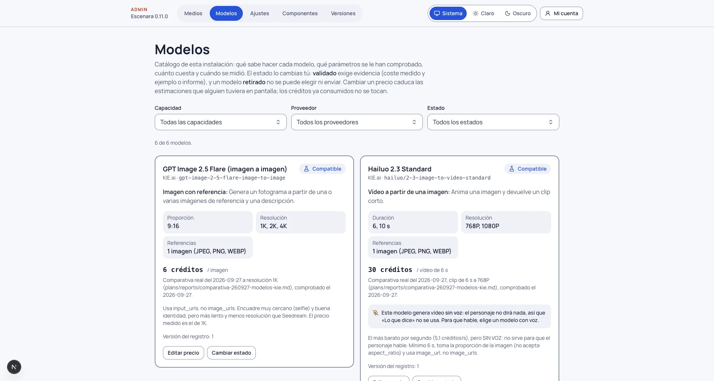

# Dar de alta un modelo

**Versión:** 0.32.1 · **Para:** quien administra una instalación de Escenara

Un modelo es lo que de verdad genera: una imagen, un clip, una voz o un texto. Escenara no lo usa por estar en la
web del proveedor: primero tiene que estar en el **catálogo** de tu instalación, con un estado que permita
elegirlo y un precio que permita **estimar antes de gastar**. Todo eso se gestiona en **Admin › Modelos**
(`/admin/modelos`).

## Cómo entra un modelo en el catálogo

Hay dos caminos, y ninguno consiste en escribir un nombre a mano:

1. **Viene de fábrica.** Cada versión de Escenara trae los modelos que se han ejecutado de verdad, con los
   parámetros que aceptan y el precio medido. Entran como **Compatible**.
2. **Lo trae la tarifa del proveedor.** En **Precios publicados** está el botón **«Sincronizar precios de kie»**.
   Lee la tabla pública de precios del proveedor **sin usar ninguna clave y sin gastar un crédito**, y lo hace sola
   una vez al día. Debajo se ve el resultado: «Última lectura: … · N modelos publicados, M que se saben pedir».

Un modelo nuevo que llega por la tarifa entra en uno de estos dos estados:

- **Precio publicado**, si esta instalación **sabe montar su petición** (conoce sus campos). Ya se puede elegir y
  estimar, y la pantalla dice que el precio lo publica el proveedor y no se ha medido aquí.
- **Descubierto**, si no se sabe con qué parámetros pedírselo. Se ve en la lista con el motivo («Sin adaptador
  todavía: no se le puede enviar nada»), pero **no se puede elegir**.

La sincronización **nunca pisa un precio medido** en tu instalación. Si el precio publicado de un modelo cambia,
las estimaciones que alguien tenga en pantalla caducan y hay que volver a confirmarlas antes de generar.

## Los cinco estados

| Estado | Qué significa | ¿Se puede elegir? |
|---|---|---|
| **Descubierto** | Aparece en el proveedor, pero Escenara no sabe con qué parámetros pedírselo | No |
| **Precio publicado** | El proveedor publica su tarifa y esta instalación sabe pedírselo | Sí, avisando de que el precio no está medido |
| **Compatible** | Ejecutado de verdad: se conocen sus parámetros y su precio medido | Sí |
| **Validado** | Además, quien administra lo ha revisado con su evidencia | Sí |
| **Retirado** | Fuera de uso: lo quitó el proveedor o no interesa mantenerlo | No |

## Dejar un modelo listo para usarse

Con el modelo localizado en la lista (filtra por **Capacidad**, **Proveedor** o estado), estos son los pasos.

### 1. Registra lo que cuesta de verdad

**«Registrar precio»** (o **«Editar precio»** si ya tiene uno) pide tres cosas:

- **Créditos por unidad** (imagen, clip, segundo…): lo que **cobró el proveedor de verdad**, no una estimación de
  terceros. Admite decimales.
- **Fuente**: dónde se midió, por ejemplo «prueba real con la cuenta de la instalación» o «panel del proveedor».
- **Comprobado el**: la fecha. Un precio sin fecha no vale: a los **90 días** se avisa de que puede haber cambiado.

La forma honrada de medirlo es generar una vez con tu propia cuenta y mirar cuántos créditos descontó el proveedor.
Cuando un trabajo termina, Escenara apunta además **lo que cobró el proveedor** y, si no coincide con la estimación,
la diferencia aparece en el **Historial del catálogo** como «Desviación de lo cobrado».

### 2. Elige la variante que se envía

Algunos modelos cobran distinto según lo que se les pide (1K, 2K o 4K; calidad rápida o cuidada). En **«Lo que se
pide y lo que cuesta»** eliges cuál se envía: **lo que elijas es lo que se pide y lo que se paga**. Cambiarla
caduca los costes que hubiera en pantalla.

### 3. Cambia su estado con evidencia

**«Cambiar estado»** abre el diálogo con el **Estado del registro** y un campo de **Evidencia**. Solo quien
administra cambia el estado, y **validar exige evidencia escrita** (al menos 20 caracteres): el coste medido y un
ejemplo o un informe. Sin evidencia el botón no se activa.

### 4. Decide si es la opción por defecto

Cada modelo muestra un botón **«Por defecto en …»** por cada capacidad que tiene (imagen desde referencias, vídeo
desde imagen, voz…). El predeterminado es el primero que se propone cuando nadie ha elegido otro.

### 5. Ordena lo que recomienda la instalación

En **«Qué recomienda esta instalación»** escribes, para cada tipo de generación, el orden en que conviene
intentarlo. Es lo que usa quien todavía no ha tocado su propio mapa en «Tu cuenta», **siempre recortado a las
claves que esa persona tenga**. Sin nada escrito, el orden sale del catálogo: primero el predeterminado. Cómo se
usa ese orden y cuándo se pasa a la reserva está en [Con qué se genera cada cosa](mapa-de-modelos.md).

## Todo queda en el historial

El **Historial del catálogo** guarda cada cambio con su fecha: «Alta en el catálogo», «Cambio de
precio», «Cambio de estado», «Cambio de variante», «Opción por defecto» y «Desviación de lo cobrado». Sirve para
saber por qué un coste cambió de un día para otro.

## Si el modelo que quieres no aparece

- **Pulsa «Sincronizar precios»**: puede que el proveedor lo haya publicado después de la última lectura diaria.
- **Aparece como Descubierto**: esta versión de Escenara no sabe pedírselo. Hace falta que alguien lo ejecute de
  verdad, anote qué campos acepta y lo añada al catálogo de fábrica en una versión nueva; la
  [guía de contribución](../../CONTRIBUTING.md) del repositorio explica cómo proponerlo.
- **Es de un proveedor que Escenara no tiene**: además de sus modelos hace falta un adaptador para ese proveedor. Lo
  mismo: se propone como contribución.
- **Es un modelo de texto, voz o transcripción de un servicio compatible con la API de OpenAI**: no hace falta darlo
  de alta aquí. Cada persona lo añade en «Tu cuenta» con su dirección, su clave y sus modelos; lo explica
  [Configurar la API de cada proveedor](configurar-la-api-de-cada-proveedor.md).

## Lo que nunca pasa

- **No se genera con un precio desconocido.** Un modelo sin precio no se puede estimar, y sin estimación no se
  gasta.
- **No se usa una clave de la instalación para generar lo de un usuario.** Cada persona paga con su propia clave.
- **Retirar un modelo no borra nada.** Deja de poder elegirse; lo que ya se generó con él se queda donde está.
