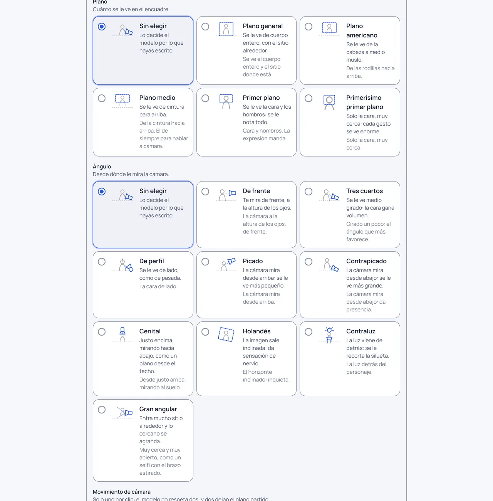
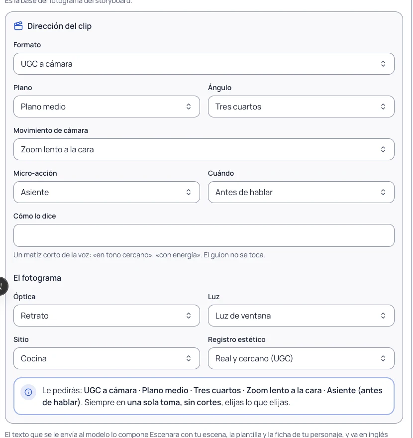
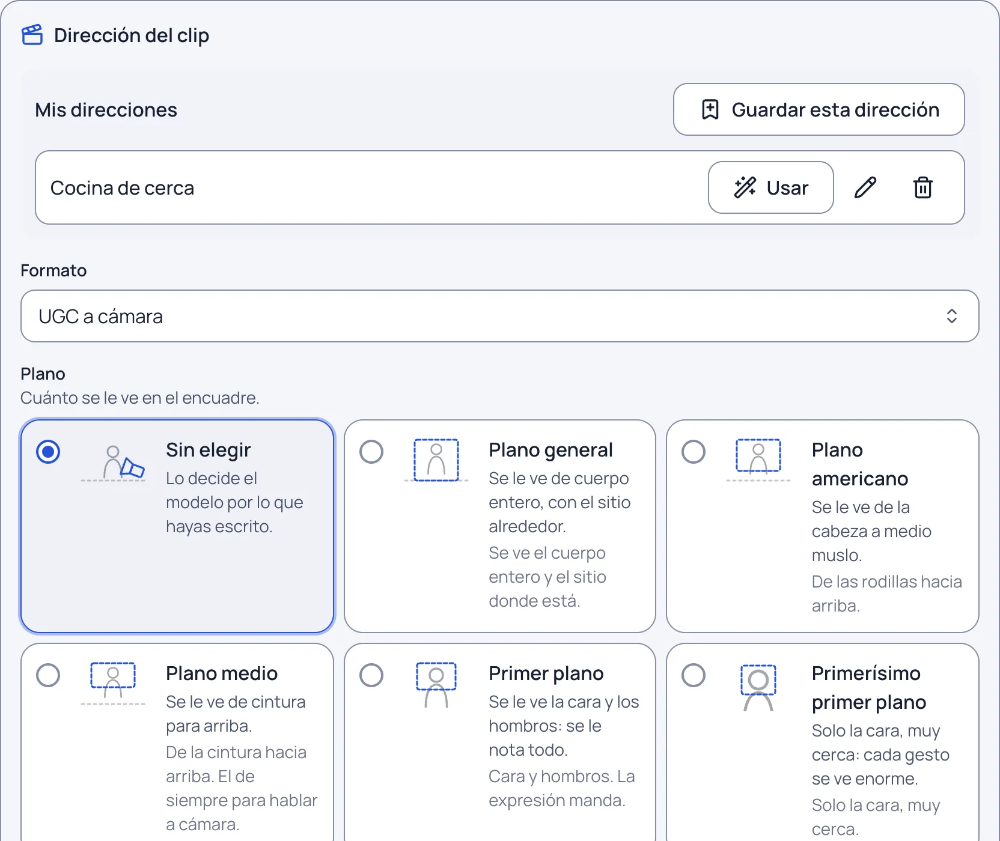
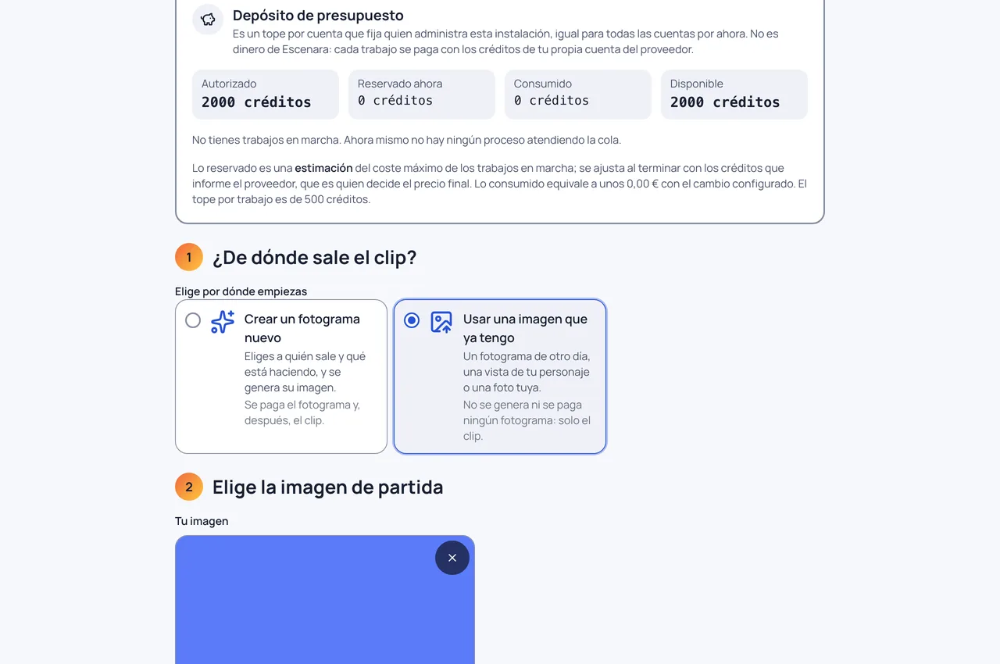
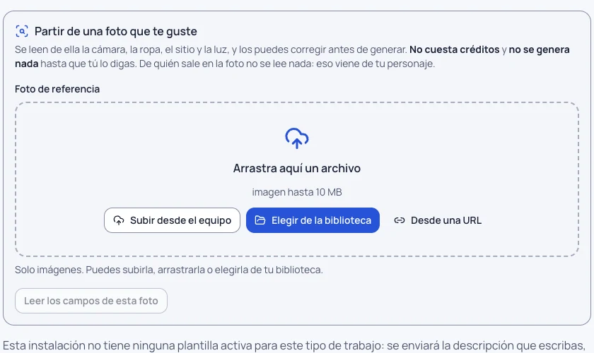

# Dirigir tu clip

Hasta ahora escribías qué se veía y qué se decía, y la cámara la ponía el programa: siempre la misma, un plano
fijo con un temblor ligero. Desde la 0.25.0 diriges tú, parte por parte, como un director. No hace falta que
sepas inglés ni que veas ningún texto técnico: eliges con botones y el programa se encarga del resto.

Diriges igual en los dos sitios donde se hacen clips: en **«Crear»** y en la **escena de un proyecto**. Cada
opción de plano, ángulo y movimiento lleva su dibujo y **una sola frase** de lo que verás, para que no haga falta
saberse las palabras del oficio. Cada grupo (Plano, Ángulo, Movimiento de cámara, El producto…) empieza con una
cabecera grande, con su icono, su título y una línea que explica para qué sirve, y hay más aire entre grupos para que
se distingan de un vistazo.

**Cada cosa se elige en un solo sitio.** Donde está el panel de dirección no vuelven a salir más abajo los
mismos botones —el plano, el ángulo, el movimiento, la micro-acción, el registro, el look o la duración— y, si
a la botonera de la plantilla no le queda nada propio que ofrecer, no aparece. Lo que elijas aquí es lo que se
le pide al modelo, y se le pide una sola vez.

En **«Crear»**, la plantilla o el trend del clip se eligen **antes**, en el primer paso («Elige el formato»),
porque un trend fija la duración y si se habla a cámara. El paso del clip ya no repite ese selector: solo ofrece los
botones que la plantilla elegida pida y que la dirección no cubra.

## Guardar una dirección y volver a usarla

Encima de los botones tienes **Mis direcciones**. Cuando tengas una forma de dirigir que te funciona, pulsa
**Guardar esta dirección**, ponle un nombre y la tendrás en la lista para usarla de un clic, tanto en «Crear»
como en la escena de un proyecto. Puedes cambiarle el nombre y borrarla.

- **Usarla no genera nada**: rellena los botones y ahí se queda. El coste se confirma después, como siempre.
- Se guarda todo lo del clip: el formato, el plano, el ángulo, el movimiento, la micro-acción y su momento, el
  registro, la voz y el acento, las instrucciones adicionales y el modo experto con su descripción. En la
  escena de un proyecto se guardan además los campos del fotograma, y el acento no se toca: ese es del
  proyecto entero.
- **Son tuyas**: nadie más las ve ni las usa.
- Si quien administra ha quitado alguna opción desde que la guardaste, esa opción se deja sin elegir y se te
  dice cuál: el resto se aplica igual.

## Las seis partes de un clip

Cada escena se dirige con seis decisiones. Ninguna es obligatoria salvo el formato: lo que no elijas se queda
en su valor sensato y se te dice cuál es.

### 1. El formato

- **UGC a cámara**: el personaje te habla mirando al objetivo. Lo que escribas en el guion es lo que se le
  oirá decir, palabra por palabra.
- **Voz en off / b-roll**: un clip **mudo**. El personaje sale con la boca cerrada y no habla. La narración se
  monta encima después.
- **Cantar con tu audio**: el personaje canta o dice, con los labios sincronizados, un audio que subes tú. Tiene su propia guía:
  [Cantar con tu audio](cantar-con-audio-propio.md).

Si eliges voz en off y tenías guion escrito, no se pierde: se te avisa de que no se envía al modelo y se
guarda para el montaje.

### 2. El plano y el ángulo

El **plano** dice cuánto se ve: del plano general (cuerpo entero y sitio) al primerísimo primer plano (solo la
cara). El **ángulo** dice desde dónde se mira: de frente, tres cuartos, de perfil, picado, contrapicado,
cenital, holandés, contraluz o gran angular.

Para hablar a cámara, el plano medio y el ángulo de tres cuartos son los que mejor funcionan.

### 3. La cámara

Qué hace la cámara durante el clip. Están ordenados en tres niveles por cuánto se puede confiar en que el modelo
los respete:

- **Básico** (sale casi siempre): quieta con gestos, plano fijo, zoom lento a la cara, zoom rápido al empezar,
  en mano sutil.
- **Con variación** (sale bien la mayoría de las veces): acercamiento sutil, retroceso que revela, órbita
  lenta, seguimiento al caminar.
- **Avanzado** (mira el clip antes de darlo por bueno): push-in a los ojos, contrapicado heroico, foco que
  cambia al fondo, cámara lenta.

> **«Antes de hablar» casi nunca sale.** Probado con clips reales: el modelo empieza a hablar en cuanto
> arranca el clip y deja el silencio al final, así que un gesto «antes» suele acabar mientras habla.
> **«Después de hablar» sí se respeta.** Y en un clip de 4 segundos una frase normal ocupa el clip entero, así
> que no hay hueco para ningún gesto suelto: si eso pasa, se te dice.

**Solo un movimiento por clip.** Si eliges dos, se te avisa y se envía el primero: los modelos, cuando les
pides dos movimientos, parten el plano en dos. Si de verdad quieres los dos, parte la escena en dos y pon uno
en cada una.

No elegir movimiento **también es una elección**: significa que la cámara se queda quieta, y así se le pide.

### 4. La micro-acción y su momento

El gesto concreto del personaje: asiente, sonríe, se encoge de hombros, señala a cámara, se toca el pelo,
suspira… Y, sobre todo, **cuándo** lo hace:

- **antes de hablar**: el gesto va primero y luego la frase;
- **mientras habla**: acompaña a la frase;
- **después de hablar**: cierra el clip con él.

Esto cambia de verdad el resultado: el modelo ejecuta las cosas en el orden en que se le piden.

### 5. El guion

Lo que dice, palabra por palabra. **No se traduce nunca**: se envía tal cual lo escribes, porque es
exactamente lo que se va a oír. Puedes añadir una **dirección vocal** corta si quieres matizar cómo lo dice:
«en tono cercano», «con energía».

### 6. La voz y el acento

La **voz se fija en el personaje**, no en la escena, con cinco ejes: género, edad, gravedad, textura y
entrega. Es parte de quién es, igual que su cara, y así no cambia de timbre de un plano a otro.

> Cambiar la voz de un personaje crea una versión nueva suya e invalida su registro de voz en el proveedor.
> Se te dice antes de hacerlo.

El **acento se elige por proyecto**, en la cabecera del proyecto, y se respeta en todas sus escenas: España
(peninsular neutro), rioplatense, bogotano, CDMX o latinoamericano neutro. De fábrica es el de España. En
«Crear» no hay proyecto, así que el acento se elige con el propio clip.

> Cambiar el acento de un proyecto que ya tiene escenas generadas **deja sin valer su voz y sus clips**: los
> dijeron con otro acento. Se te dice cuántas son y se te pide que lo confirmes. No se borra ni se regenera
> nada: tú decides qué vuelves a generar y pagas.

## Escríbelo tú

Los botones cubren lo habitual, pero no todo. Debajo de ellos hay dos formas de escribir tú:

- **Instrucciones adicionales (en español)**: se **suman** a lo que has elegido, no lo sustituyen. «Que sostenga
  el bote con la etiqueta hacia la cámara.» Entra en el prompt en su sitio, junto a la descripción de la escena;
- **modo experto**: escribes la descripción entera del clip y los botones de dirección dejan de aplicarse. Se
  quedan a la vista, apagados, para que veas qué has dejado sin efecto.

En los dos casos escribes en español: la traducción la hace el programa. Lo que no puedes quitar, ni escribiendo
la descripción entera: la **toma única**, los **anclajes de realismo** y, con una persona real, la prohibición
de retocarla. Y lo que escribas es contenido, nunca ajustes del proveedor: si cuelas algo como `--seed=42`, se
quita.

El acento y la voz siguen siendo tuyos también en modo experto: describen quién habla, no lo que se ve.

## Empezar desde una imagen que ya tienes

No hace falta generar un fotograma nuevo para cada vídeo. Lo primero que eliges en «Crear» son dos caminos:

- **crear un fotograma nuevo**: eliges a quién sale y qué está haciendo, y se genera su imagen;
- **usar una imagen que ya tengo**: un fotograma de otro día, una vista de tu personaje o una foto que subas.

Con el segundo camino **los pasos del fotograma desaparecen de la barra**: no hay formulario que rellenar ni imagen que
estimar, porque no se va a generar ninguna. Pasas directamente a dirigir y generar el clip. **Elegir la imagen
no cuesta nada**; lo único que se paga es el clip.

Tampoco tienes que describir la escena: la imagen ya dice lo que se ve y la dirección pone el encuadre. Si
quieres añadir algo, escríbelo en **instrucciones adicionales**.

En la escena de un proyecto es lo mismo: al lado del fotograma puedes traer una imagen tuya y la escena la toma
como su fotograma aprobado.

Si esa imagen salió de un trabajo hecho con un personaje tuyo, el clip hereda ese personaje y todas sus reglas:
su consentimiento tiene que seguir vigente y vuelves a confirmar la revisión de sus fotos.

## Otro clip con el mismo fotograma

Cuando un clip esté listo, tienes dos botones al lado:

- **Cambiar y volver a generar**: vuelve a abrir la dirección tal como se usó en ese clip, para que cambies lo
  que quieras —el plano, el movimiento, el texto— y lances otro desde el mismo fotograma;
- **Otro clip con este fotograma**: lo mismo, empezando por lo que tengas puesto ahora.

**Nada se sustituye.** Los clips anteriores siguen en tu biblioteca y en el historial de la escena. Cada clip
nuevo lleva su estimación y su confirmación de coste, como cualquier otro gasto.

## Una sola toma, siempre

A todos los clips se les pide **una sola toma continua, sin cortes**, y que la cámara se quede quieta al
terminar el movimiento. No es una opción y no se puede desactivar: sin eso, los modelos cortan a media frase.

Antes de generar verás, en castellano, un resumen de lo que has pedido. No es el texto que se le manda al
modelo —ese es cosa del programa y solo lo ve quien administra—: es tu elección, escrita para que la
reconozcas.

## El fotograma: las seis C

El clip nace de un fotograma, y el fotograma se dirige con seis bloques que van siempre en el mismo orden.
**Esto se elige donde el fotograma se genera**: en la escena de un proyecto, con el clip; y en «Crear», en el
paso del fotograma. Cuando animas una imagen que ya tienes no hay nada de esto que elegir, porque no se va a
generar ningún fotograma, y por eso el panel de dirección no te lo ofrece.

| | Qué fija |
|---|---|
| **Personaje** | Quién es. Si es una persona real, sale de sus fotos de referencia |
| **Cámara** | Plano, ángulo y óptica |
| **Ropa** | El outfit, el estilismo y los accesorios |
| **Sitio** | Dónde está y qué se ve detrás |
| **Luz** | Qué luz hay, sus sombras y su grano |
| **Realismo** | Piel de verdad, anatomía correcta y nada escrito en la imagen |

El último bloque **no se puede quitar**: es lo que separa una foto creíble de un dibujo por ordenador. Lo
compone quien administra la instalación.

### Con una persona real no se la embellece

Si el personaje es una persona real, su identidad sale de sus referencias y se le pide expresamente al modelo
que **no la retoque, no la adelgace y no le cambie el atractivo**. Las descripciones de belleza solo existen
para personajes inventados, y solo si tú las eliges: nunca por defecto.

### El registro estético

Dos acabados, elegibles por escena:

- **Real y cercano (UGC)**: luz del sitio, cámara en mano, como un vídeo grabado sin pensarlo.
- **Cuidado (estilo influencer)**: luz trabajada y encuadre limpio.

Cambia la cámara, la luz y la textura. **No cambia quién es la persona.**

## Partir de una foto que te gusta

Sube una foto de referencia y el programa lee de ella la **cámara**, la **ropa**, el **sitio** y la **luz**, y
te los deja escritos en campos que puedes corregir. No lee quién es la persona: eso sale de las referencias de
tu personaje.

Antes de leer nada se te pide permiso, porque **la foto se sube a un servicio externo**: si es la foto de un
personaje tuyo hace falta la autorización de comprobación de parecido de su consentimiento, y si es una foto
suelta, que lo confirmes tú. Sin eso
la imagen no sale de aquí.

**No se genera nada hasta que confirmas esos campos.** Lo que un modelo cree ver no es necesariamente lo que
tú quieres pedir, y darlo por bueno sin mirarlo sería gastarte el dinero en la interpretación de otro. Si algo
no se ha podido leer, se te dice cuál y lo escribes tú.

## Cambiar solo una cosa

Partiendo de un fotograma que ya has aprobado, puedes cambiar **una sola cosa** y dejar todo lo demás
idéntico: la ropa, el sitio o la postura. Puedes añadir una segunda foto de referencia (la prenda, el fondo).

Es también la forma de hacer un **antes/después**: dos salidas de la misma imagen con un rasgo cambiado.

## ¿Ha salido lo que pediste?

Cuando el clip está hecho, puedes pedir que se compruebe si **hace lo que dirigiste**: si tiene el plano, el
movimiento, el gesto y el momento que elegiste, y si es una sola toma sin cortes. El veredicto viene con su
motivo y con dos botones —«tiene razón» y «se equivoca»— que son lo único con lo que se mide si acierta.

De fábrica esta comprobación va **en sombra** y **no bloquea nada**: se registra y se te enseña, para poder medir cuánto acierta
antes de darle poder. Quien administra puede apagarla en Admin › Ajustes › Coherencia (mira [Comprobar la coherencia](comprobar-la-coherencia.md)).

## Lo que ya está comprobado y lo que no

Probado con clips reales el 28/09/2026:

- **la regla de una sola toma funciona**: ninguno de los ocho clips salió cortado;
- **el movimiento de cámara se respeta**, incluido uno de los avanzados (el acercamiento a los ojos), y
  también el plano, el ángulo, el sitio y el acabado;
- **«después de hablar» se respeta y «antes de hablar» no**, por cómo reparte el modelo el tiempo del clip.

Todavía sin comprobar: si el **acento** suena como se pide (hay que escucharlo) y los movimientos avanzados
que no se han probado.

La **hoja de identidad 3×3** (nueve retratos en una imagen) nace como **candidata** y **no se usa** salvo que
tú lo pidas. Puedes **generarla desde la ficha del personaje**, en la pestaña «Referencias»: cuesta lo mismo que
un fotograma y se confirma como cualquier otra generación. Desde ahí también la descartas («Descartarla») o la
haces la referencia fija del personaje («Usarla siempre en este personaje»). En la ficha del personaje hay un
interruptor, apagado de fábrica: «Probar la hoja en la mitad de
mis escenas». Si lo enciendes, la mitad de sus escenas se harán solo con la hoja para poder comparar cuál da
mejor parecido; cuestan lo mismo y cada escena te dice con cuál se hizo. Puedes apagarlo cuando quieras.
