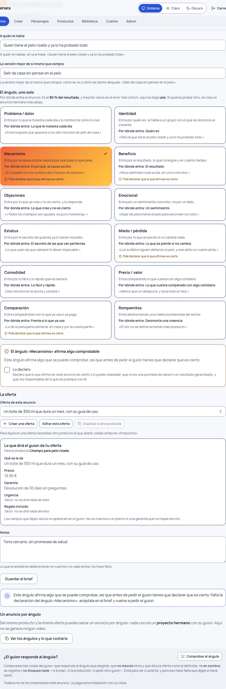
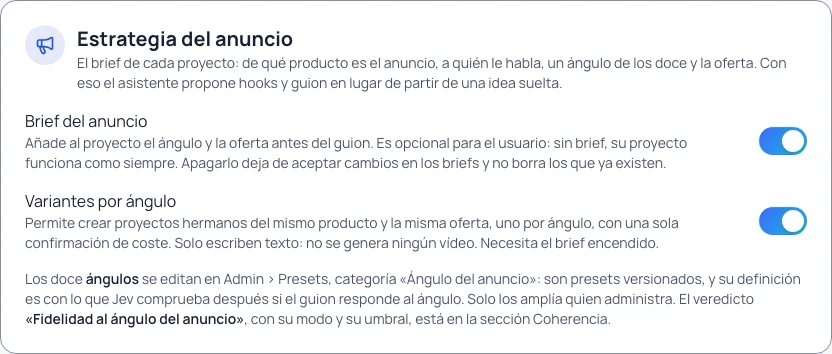

# La estrategia del anuncio

Un anuncio no es creatividad. Es un **sistema con tres palancas**, y no pesan lo mismo:

1. **El ángulo** — a quién le hablas y desde qué dolor o deseo entras. Es **el 80 % del resultado**.
2. **La oferta** — qué le das y cómo lo empaquetas.
3. **La creatividad** — el hook, el montaje, la música, los efectos. **Amplifica** las dos anteriores, pero no
   salva un anuncio con mal ángulo.

Y debajo de las tres, la idea que lo explica todo: **la gente no compra productos, compra una versión mejor de sí
misma**. El anuncio es lo que conecta tu producto con esa versión.

Hasta la 0.26.x Escenara cubría bien la palanca 3 —dirigir el clip, el producto, la voz— y el guion nacía de una
idea suelta que escribías tú. Desde la 0.27.0 las dos palancas que deciden van **delante** del guion, en el
**brief del anuncio**.

## El brief, primer paso del proyecto

En la barra de pasos del proyecto, el paso 1 es el brief, y un proyecto nuevo se abre en él. Tiene cinco cosas:

| Qué | Para qué sirve |
|---|---|
| **De qué producto es** | El producto que ya diste de alta en «Productos», con sus fotos y su descripción. |
| **A quién le habla** | El público, en una frase: «quien tiene el pelo rizado y ya lo ha probado todo». |
| **La versión mejor de sí mismo** | Cómo se ve o cómo se siente después: «salir de casa sin pensar en el pelo». |
| **El ángulo** | **Uno** de los del catálogo. |
| **La oferta** | Qué se le da, y opcionalmente precio, garantía, urgencia y regalo. |

**El brief es opcional.** Si no lo rellenas, tu proyecto funciona exactamente como antes: escribes la idea, el
asistente propone un guion y produces. El brief no es un peaje, es lo que hace que el guion deje de salir de la
nada.

Para **pedir hooks y guion desde el brief** hacen falta tres cosas y solo tres: el producto, el ángulo y «qué se
le da». Si falta alguna, se dice **cuál** falta, no un «no se puede».

## Un solo ángulo por vídeo

Esta es la regla dura de la versión, y no es un consejo: el brief guarda **un** ángulo, no una lista. Mezclar
varios en el mismo vídeo es el error más común y se nota en el resultado, porque el espectador no sabe por dónde
le están entrando.

Los doce ángulos del catálogo, con un ejemplo de champú para pelo rizado en todos para que se vea la diferencia:

| Ángulo | Por dónde entra | Ejemplo |
|---|---|---|
| Problema / dolor | Lo que le molesta cada día | El encrespado que aparece a los diez minutos de salir de casa |
| Identidad | Quién es | Para la que tiene el pelo rizado y ya lo ha probado todo |
| Mecanismo | El porqué, la causa oculta | El culpable son los sulfatos del champú de siempre |
| Beneficio | El resultado | Rizos definidos todo el día, en cinco minutos |
| Objeciones | Lo que cree y no es cierto | «Todos los champús son iguales, es puro marketing» |
| Emocional | Un sentimiento | Dejar de plancharse el pelo para esconder los rizos |
| Estatus | El secreto de las que van perfectas | Lo que usan las que siempre lo llevan impecable |
| Miedo / pérdida | Lo que se pierde si no cambia | Los sulfatos siguen dañando el pelo, y ese daño no vuelve atrás |
| Comodidad | Lo fácil y rápido | Dos minutos en la ducha y ya está |
| Precio / valor | Lo que cuesta comparado con algo cotidiano | Menos que un desayuno, y dura todo el mes |
| Comparación | Frente a lo que ya usa | Lo de la peluquería semanal, en casa y por la cuarta parte |
| Rompemitos | Desmonta una creencia | El rizo no se define echando más producto |

El catálogo **lo amplía quien administra** la instalación, no cada usuario: la definición de cada ángulo es con
la que se comprueba después si tu guion le responde, así que tiene que haber una sola referencia.

### Cuatro ángulos piden que declares que es cierto

**Mecanismo**, **beneficio**, **miedo / pérdida** y **comparación** afirman algo sobre el mundo que se puede
desmentir. Al elegir uno de ellos aparece el texto entero de la declaración y una casilla: declaras que lo que
afirmas es cierto y lo puedes respaldar, que no es una promesa de salud ni un resultado garantizado, y que eres
responsable de lo que se publique.

Sin esa declaración **no se pide el guion**. Se guarda con su fecha y su dirección IP, igual que el
consentimiento de un personaje, y se guarda el texto **tal como lo aceptaste**: si cambia en una versión futura,
tu declaración conserva el suyo.

## La oferta: lo que no escribes, no se dice

La oferta es una ficha reutilizable **atada a un producto**. Solo **«qué se le da»** es obligatorio; precio,
garantía, urgencia y regalo son opcionales.

Lo importante: **un campo vacío no aparece en el guion**. No se inventa un precio que no has puesto ni una
garantía que no ofreces, y el brief te enseña uno a uno cuáles se van a quedar callados antes de que pidas nada.

La misma oferta sirve para las doce variantes del mismo producto y se edita en un solo sitio. Y se puede
**duplicar** a otro producto cuando la promoción es la misma: la original no se toca.

## Los hooks: la palanca 3, detrás de las dos que deciden

Con el brief listo, «Pedir 5 hooks y el guion» propone **cinco arranques distintos** y un guion por escenas, todo
desde **tu** ángulo y **tu** oferta. Cuesta una llamada de texto de tu mapa de modelos, con su estimación y su
confirmación, como el resto del texto de Escenara.

Los cinco hooks **no pasan al guion hasta que eliges uno**: son una propuesta. La última propuesta pagada se
conserva y se enseña al volver a abrir la pantalla, para que un corte de red no te la haga perder. Los puedes
reescribir y eliges uno. Al elegirlo:

- se escribe como **primera frase del guion**, no como un campo aparte;
- su movimiento de cámara y su gesto —elegidos del catálogo de dirección, no inventados— pasan a la **primera
  escena**. Si ya habías dirigido esa escena a mano, **no se pisa** y se te dice por qué.

Elegir un hook no cuesta nada: los cinco ya están pagados.

## Un anuncio por ángulo

Del mismo producto y la misma oferta puedes sacar un anuncio por ángulo. Cada uno es un **proyecto hermano**, con
su título «Tu título · Ángulo», su brief y su guion. Hasta **doce de una vez**, con **una sola confirmación de
coste**: lo que cuesta una llamada de texto por las variantes que elijas.

Los ángulos que ya tiene algún hermano del grupo salen deshabilitados **con su motivo**: dos hermanos con el
mismo ángulo serían el mismo anuncio dos veces. Y aquí **no se genera ningún vídeo**: se escriben proyectos con su
guion en borrador, que después apruebas y produces uno a uno como siempre.

## ¿El guion responde al ángulo?

El botón «Comprobar el ángulo» le pide a Jev tres cosas del guion: que responda al ángulo que elegiste, que **no
mezcle otros** —y si los mezcla, dice **cuáles**— y que la oferta aparezca como la definiste.

Se pide **a mano**, nunca solo. Y de fábrica va **en sombra** (lo explica [Comprobar la coherencia](comprobar-la-coherencia.md)):
se registra con su evidencia y **no bloquea nada** —ni el plan, ni la producción, ni pedir otro guion—. Está para
medir si acierta, y para eso hace falta que le digas si tiene razón o se equivoca con los dos botones de al lado.
Cuando los números digan que acierta, quien administra puede cambiar su modo a «Activa» en Admin › Ajustes ›
Coherencia; aun así, hoy el código no bloquea nada con este veredicto: el ángulo no se impone, se te enseña. El panel lo dice con
esas palabras cuando está en Activa: «todavía no bloquea nada».

## Lo que esta versión no hace todavía

Escenara **produce** las variantes; no mide todavía cómo van en campaña. Conectar con las plataformas de anuncios
y comparar ángulos por sus resultados reales está anotado en la hoja de ruta, sin versión asignada.

## Si el brief no aparece

Quien administra la instalación puede apagar el brief y las variantes en **Admin › Ajustes › Estrategia del
anuncio**.

Apagarlos no borra ni esconde nada de lo que ya escribiste: el proyecto vuelve a comportarse como antes
de la 0.27.0 y se dice en pantalla.
