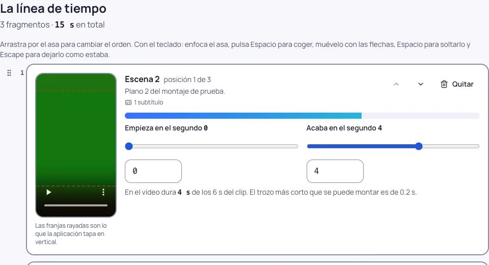
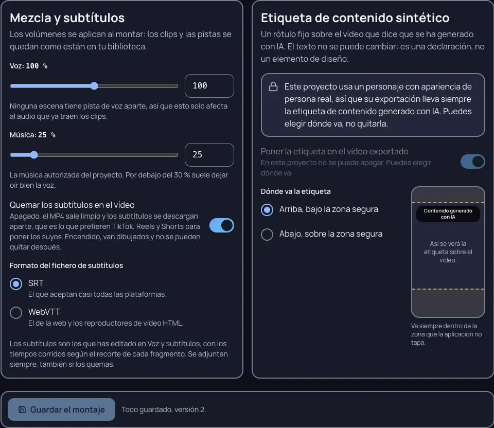
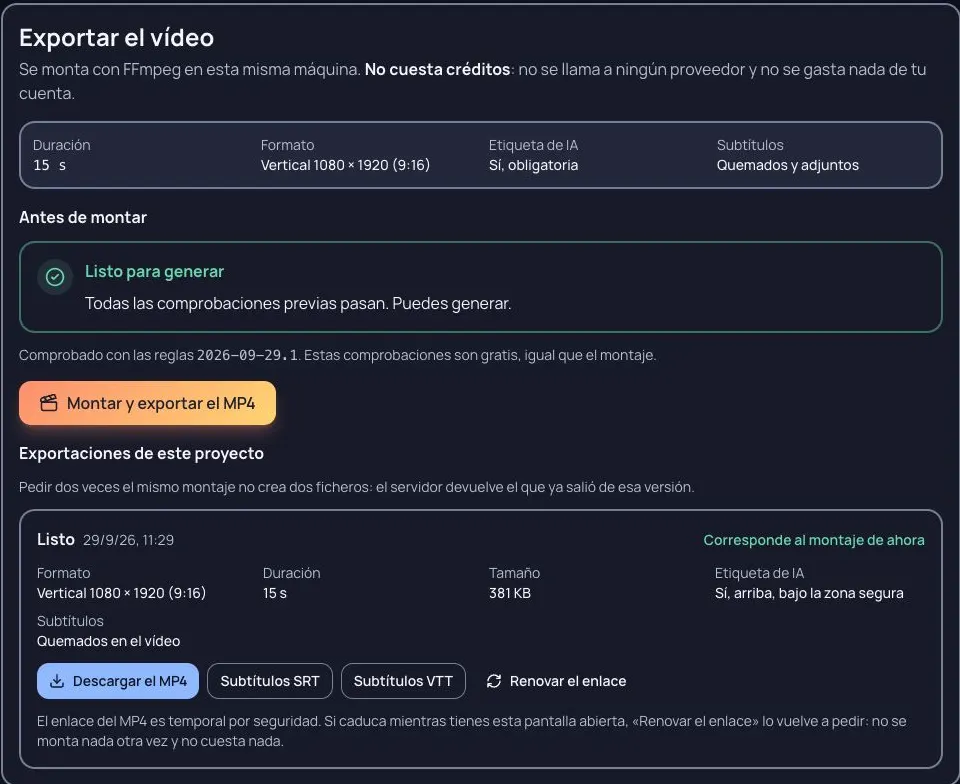

# Montar y exportar tu vídeo

Cuando todas las escenas tienen su clip, falta lo último: ponerlos en orden, recortar lo que sobra, decidir cómo
suenan la voz y la música, y sacar **un MP4 vertical listo para publicar**. Eso es el montaje, y está en
**Proyecto › Montaje** (`/proyectos/…/montaje`), al que llegas desde el plan del proyecto y desde producción.

Dos cosas antes de empezar, para que no haya sorpresas:

- **Montar y exportar no cuesta créditos.** El vídeo se monta con FFmpeg en la misma máquina donde está instalada
  Escenara: no se llama a ningún proveedor y no se gasta nada de tu cuenta. Puedes exportar las veces que quieras.
- **Recortar no toca tus clips.** Siguen enteros en tu biblioteca. El montaje solo guarda dónde empieza y dónde
  acaba cada trozo.

## 1. La línea de tiempo

Un clip traído de **Crear** con «Convertir en proyecto» se monta igual que cualquier escena, aunque el proyecto
siga en borrador ([De Crear a un proyecto](de-crear-a-un-proyecto.md)).

Al abrir la pantalla, Escenara pone en la línea de tiempo **una escena por fragmento**, en el orden del guion y sin
recortar. Cada tarjeta tiene su previsualización en un marco vertical con las **zonas seguras** dibujadas: lo que
queda fuera de ellas es lo que las plataformas tapan con su interfaz.

Lo que puedes hacer con un fragmento:

| Qué | Cómo |
|---|---|
| **Cambiar el orden** | Arrastrando la tarjeta, con el teclado sobre el asa de arrastre, o con los botones de subir y bajar de cada tarjeta. |
| **Recortar** | Las dos manecillas de entrada y de salida, o su campo numérico si quieres el segundo exacto. |
| **Quitarlo** | El botón «Quitar». La escena no se borra: pasa a «Escenas que no están en el montaje». |
| **Volverlo a poner** | El botón con el número de la escena, en ese mismo apartado. Entra al final y sin recortar. |

Arriba ves cuántos fragmentos hay y **cuántos segundos** suman. Por encima de **60 s** aparece un aviso: un reel se
ve hasta el final mucho más a menudo por debajo de esa cifra. Es un consejo, no un freno; el tope de esta versión
son **300 s** y **60 fragmentos**.

Una escena solo puede estar **una vez** en la línea de tiempo: en el apartado de abajo únicamente se ofrecen las
que están fuera.

## 2. Mezcla y subtítulos

En **Mezcla y subtítulos** se decide cómo suena el montaje y qué pasa con el texto:

- **Voz** y **Música**, de **0 % a 200 %** cada una. Se aplican al montar: las pistas y los clips se quedan como
  están en tu biblioteca. La voz que va dentro del clip, las pistas de voz del proyecto y la música autorizada se
  mezclan sin normalizar, así que subir la música **no** baja la voz por su cuenta.
- **Quemar los subtítulos en el vídeo**. Apagado —así viene— el MP4 sale limpio y los subtítulos se descargan
  aparte, que es lo que prefieren TikTok, Reels y Shorts para poner los suyos. Encendido van dibujados en la imagen
  y **no se pueden quitar después**.
- **Formato del fichero de subtítulos**: **SRT** o **WebVTT**. Los tiempos se corren solos con tus recortes, y si un
  subtítulo se queda a medias en el corte, se acorta o se descarta.

Una escena con el **audio del clip quitado** entra en silencio: el MP4 no lleva el sonido de ese clip, pero sí su
pista de voz aparte si la tiene y la música. Sin pista de voz aparte tampoco lleva subtítulos, porque no se oye nada. Se decide en el paso **Escenas** del proyecto, no aquí, y su fragmento lo
dice con **«Sin el audio del clip»** ([Voz y subtítulos](voz-y-subtitulos.md)). Cambiarlo
cambia el vídeo, así que la exportación anterior deja de ser «la del montaje de ahora».

La música autorizada del proyecto entra **desde el principio** y se corta cuando acaba el montaje: no se repite si
es más corta ni se le hace un fundido.

## 3. La etiqueta de contenido sintético

Un rótulo fijo sobre el vídeo que dice **«Contenido generado con IA»**. El texto no se puede cambiar: es una
declaración, no un elemento de diseño. Siempre aparece; eliges **dónde va**, arriba o abajo, dentro de la zona segura.

**La etiqueta no se puede apagar en ningún montaje**, tampoco si todos los personajes son animados. El interruptor
aparece bloqueado y la pantalla dice por qué. Lo impide el servidor, así que tampoco se puede saltar desde otra
herramienta.

Si la máquina donde está instalada Escenara **no puede dibujar la etiqueta** —le falta una fuente o el soporte de
texto de FFmpeg— la exportación **no se hace**, y el mensaje dice exactamente qué instalar. Se prefiere no entregar
el vídeo antes que entregarlo sin la etiqueta.

Lo que la etiqueta **no** es: una firma de procedencia. Los metadatos C2PA llegan en la 0.46.0. Y lo que **no**
hace: no sustituye a la etiqueta que cada plataforma te pide marcar al publicar. Marca las dos.

## 4. Guardar

El guardado es **explícito**: reordenar y recortar no guardan nada hasta que pulsas **«Guardar el montaje»**, en la
barra que se queda pegada abajo. Es a propósito, porque un montaje se tantea y cada arrastre no debe convertirse en
una versión nueva.

- Mientras haya cambios sin guardar, la barra lo dice. Guardar tampoco cuesta nada: es escribir una línea de tiempo.
- Cada guardado sube la **versión** del montaje, y la barra te dice en cuál estás.
- Si has abierto la pantalla **en dos sitios** y el otro se adelanta, el guardado se detiene, se te dice que el
  montaje ha cambiado y **lo que estabas editando se queda en la pantalla** para que lo repitas sobre lo último.

## 5. Exportar y descargar

El panel **«Exportar el vídeo»** resume lo que va a salir: duración, resolución **1080 × 1920**, subtítulos y
etiqueta. Debajo, **«Antes de montar»** enseña la comprobación previa. El botón es **«Montar y exportar el MP4»**.

Mientras se monta, el progreso va por las **etapas reales** de FFmpeg: preparando, normalizando, montando,
guardando. No es una barra inventada; se lee del propio render. Al terminar tienes:

- **Descargar el MP4**, con enlace temporal que se renueva si caduca;
- los **subtítulos** en SRT y en WebVTT, tal como se montaron.

El MP4 se guarda en tu biblioteca y ocupa **cuota** como cualquier archivo tuyo.

**Puedes seguir editando después de exportar.** Por eso cada exportación anterior dice si **«Corresponde al montaje
de ahora»** o si es de antes del último cambio: así no publicas por descuido la versión vieja. Y pedir dos veces la
exportación del **mismo** montaje no crea dos ficheros: se te devuelve la que ya hay.

No hay botón de cancelar: un render local no cuesta nada y se detiene solo si pasa de **15 minutos**, diciéndote que
dividas el montaje.

## Qué bloquea exportar, y cómo se arregla

La comprobación previa se hace **antes** de bajar el primer byte, y siempre dice **cuál** es el problema:

| Lo que dice | Qué pasa | Cómo se arregla |
|---|---|---|
| «La escena N tiene una afirmación sobre salud sin verificar» | Lo que se dice en esa escena afirma algo de salud y nadie lo ha revisado (en cualquier proyecto: por ejemplo, si editaste el texto de la escena después de aprobar el plan, o en un clip traído de Crear, que no ha pasado por esa aprobación) | Verifícala, corrígela o descártala en el paso Escenas del proyecto |
| Un **fallo crítico abierto** en la revisión de continuidad | La escena tiene un problema que marcaste como crítico | Ve a «Revisión», arréglalo o ciérralo como aceptado ([Revisar la continuidad](revisar-la-continuidad.md)) |
| «La escena N está en el montaje y todavía no tiene clip guardado» (o «N escenas del montaje todavía no tienen clip guardado», con sus números) | El clip de esa escena se borró o nunca se generó | Prodúcelas o quítalas de la línea de tiempo |
| «La línea de tiempo de este montaje está vacía» | Lo has vaciado | Añade al menos una escena con clip desde el apartado de abajo |
| «El fragmento N (escena M) dura menos de 0,2 s: recórtalo menos» | Un recorte se ha quedado demasiado corto | Recórtalo menos |
| «Acaba en el segundo X y el clip dura Y» | El recorte se sale del clip | Baja la manecilla de salida |
| «El montaje dura N s y el máximo de esta versión son 300 s» | Pieza demasiado larga para esta versión | Quita fragmentos o recorta más |
| No hay espacio en la biblioteca | La cuota está llena y el MP4 no cabría | Borra material que no uses o pide más cuota a quien administra |
| «No se encuentra «ffmpeg» en esta máquina…» (o «ffprobe») | Falta la herramienta en la máquina | Es cosa de quien administra la instalación: instalar FFmpeg con soporte de texto |
| «El montaje está desactivado en esta instalación» | El interruptor de Admin › Ajustes › Montaje y exportación está apagado | Pídeselo a quien administra |
| «Tienes cambios sin guardar» | Se exportaría el montaje **guardado**, no lo que ves | Guarda antes de montar |

Si el render falla ya empezado —un clip roto (entonces el motivo es «El fragmento N del montaje ya no tiene clip»),
una máquina sin recursos— la exportación queda como **fallida con su motivo** y puedes volver a pedirla. Se intenta hasta tres veces antes de darse por vencida.

## Un recorrido de referencia

La prueba de esta versión dejó un montaje que puedes repetir sin generar nada con IA: tres clips locales de **6 s**
cada uno, con audio y un subtítulo por escena. Se abrió la línea de tiempo con las escenas 1, 2 y 3 y se hizo esto:

1. Subir la escena **2** a la primera posición y recortarla de **0 a 4 s**.
2. Recortar la escena **1** de **1 a 6 s**. La escena 3 queda entera: el orden final es **2, 1, 3** y dura **15 s**.
3. Poner la música al **25 %**, quemar los subtítulos y situar la etiqueta **arriba**. El interruptor de la etiqueta
   se ve bloqueado y encendido en cualquier proyecto.
4. Pulsar **Guardar el montaje**: pasa a la versión 2. Después pulsar **Montar y exportar el MP4** y descargarlo
   desde la tarjeta «Listo». Volver a pedir esta misma versión devuelve la misma exportación.

El MP4 descargado dio en `ffprobe` **H.264, 1080 × 1920, audio AAC estéreo y 15,016 s**. El primer plano es el de
la escena 2; en él se ven tanto el rótulo como su subtítulo. SRT y WebVTT quedan guardados con la exportación.

## Lo que esta versión no hace

Sin transiciones, sin efectos, sin curvas de audio ni multipista, y con un único formato: **vertical 9:16**. Los
formatos 16:9 y 1:1 llegan en la 0.41.0, y los metadatos de procedencia C2PA en la 0.46.0.

## Ver también

- [Voz y subtítulos](voz-y-subtitulos.md) — de dónde salen los subtítulos que se montan aquí.
- [Producir tu proyecto](producir-tu-proyecto.md) — cómo se generan los clips que se montan.
- [Revisar la continuidad](revisar-la-continuidad.md) — qué es un fallo crítico y por qué frena exportar.
- [Cumplimiento y privacidad](../legal/cumplimiento-y-privacidad.md) — la nota legal de la etiqueta.
