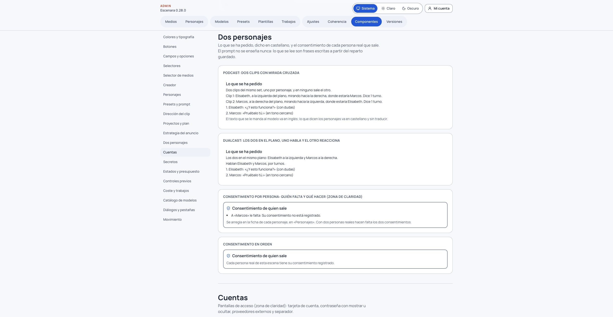

# Podcast y dualcast: dos personajes en una escena

**Versión:** 0.28.0 · **Para:** quien usa Escenara

En una escena hablada puedes montar una conversación entre **dos personajes tuyos**. Elige el formato en **Proyecto › Escenas › Reparto**. Necesitas el modo de voz **Omni**, una voz registrada para el proyecto y cada personaje registrado con esa voz y con su ficha vigente. [Escenas habladas](escenas-habladas.md) explica esos registros; hacerlos no gasta créditos.

| Formato | Qué se genera | Coste que confirmas |
|---|---|---|
| **Un personaje** | Un personaje, como hasta la 0.27.0 | El de un clip; la escena sigue el camino anterior |
| **Podcast (dos clips)** | Dos clips, uno por personaje, en el orden del reparto | La suma de los dos clips, en una confirmación |
| **Dualcast (los dos en el plano)** | Un clip con las dos caras en el mismo plano | El de un clip |

En el spike del 29/09/2026, un clip de 4 s a 720p con Gemini Omni Flash 1.1 costó **63 créditos** tanto con uno como con dos `character_ids`: tres clips costaron 189. Esa cifra es una medida de aquella prueba. La pantalla muestra la **estimación vigente**, con fecha del precio, segundos y coste de cada clip y total. Si la instalación traduce el texto del prompt, incorpora una vez el coste máximo de esa traducción. Si cambia la tarifa, el servidor rechaza la confirmación antigua; no cobra otro importe sin que lo veas.

## Montar el reparto

1. Abre el proyecto y una escena en **Escenas › Reparto**. «Un personaje» conserva la escena de un personaje.
2. Elige **Podcast** o **Dualcast** y añade otro personaje de los tuyos. El límite es **dos**. Podcast y dualcast **no admiten una escena con producto**: quita el producto de la escena antes de elegirlos. Si un formato está apagado, la pantalla indica que se activa en **Admin › Ajustes › Dos personajes**.
3. Ajusta **papel** (habla o acompaña), **lado** y **mirada**. En podcast se propone el lado opuesto y la mirada cruzada. En dualcast ambos comparten plano: quien no habla escucha y reacciona.
4. En **El diálogo, turno a turno**, asigna a cada frase su personaje, escribe lo que dirá **literalmente** y, si quieres, una dirección vocal. Puedes ordenar los turnos arrastrándolos por su asa (o con el teclado, o con Subir y Bajar) y quitarlos. El texto hablado **no se traduce**; la dirección vocal sí puede traducirse para componer la petición.
5. Revisa **Lo que se ha pedido**: resume en castellano quién sale, dónde mira y qué dice. Nunca muestra el prompt interno. Si el diálogo no cabe en los segundos del clip, aparece un aviso con las palabras y los segundos necesarios. Puedes acortarlo o confirmar expresamente que quieres seguir.

Sin turnos, el modelo decide quién dice cada frase. **Los dos registros de personaje usan ahora la voz Omni del proyecto**, así que ambos saldrán con el mismo timbre aunque sus fichas tengan voces predefinidas distintas. La pantalla lo avisa y pide una casilla antes de pagar; dos voces Omni distintas en la misma escena todavía no están disponibles.

## Consentimiento y producción

La zona **Consentimiento de quien sale** nombra a cada personaje al que le falta algo y te dirige a su ficha. Con **dos personas reales hacen falta dos consentimientos vigentes**, uno por persona; sin los dos la generación queda bloqueada. Si uno es inventado, debe tener su declaración de personaje inventado y la persona real su consentimiento. De forma provisional se usa el consentimiento individual de la 0.13.0; no se pide otro documento por aparecer juntos.

En **Producción** verás la estimación por clip y total. Confirma una sola vez **el total exacto** y los avisos aplicables. El podcast reserva y cierra el coste de cada clip por separado: cancelar uno no cobra el otro. Cuando se hayan pedido, la tarjeta muestra los **dos clips en orden y con el nombre del personaje**. Esos dos clips se ordenan y se recortan después en [Montaje y exportación](montaje-y-exportacion.md); aquí quedan marcados el orden y el personaje.

En **Revisión › Coherencia**, Jev muestra la identidad **por cara** y señala sobre qué personaje es cada decisión. `reparto_fiel` comprueba si cada frase la dijo quien se pidió. Nace **en sombra**: informa, no bloquea el clip.

## Límites comprobados

En las tres pruebas reales del 29/09/2026, las caras salieron separadas y la mirada cruzada del podcast se respetó. La **persona real salió algo rejuvenecida**, aunque reconocible. El **set de los dos clips del podcast no fue idéntico** y el **lado del cuadro no siempre se respetó**; incluso asomó parte de otro cuerpo en un plano que debía ser individual. Revisa cada clip y sus veredictos antes de utilizarlo.

Si no puedes generar, consulta [Por qué no puedo generar](por-que-no-puedo-generar.md).
