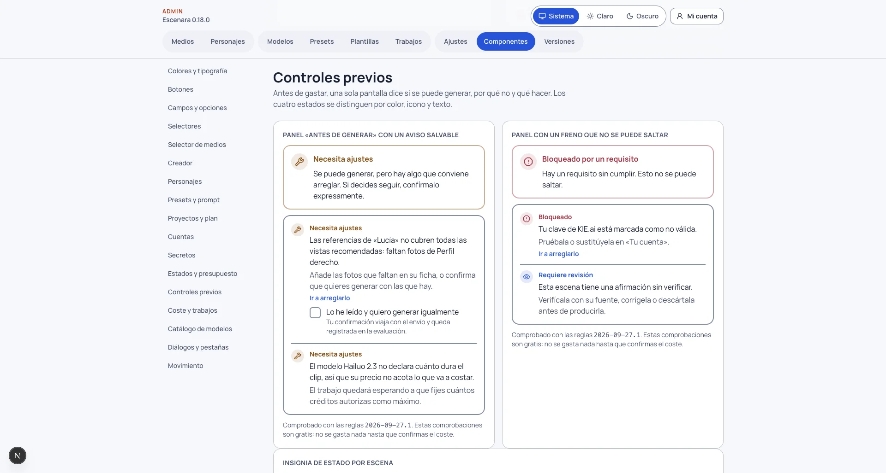

# Por qué no puedo generar

Guía de uso · puesta al día en la versión 0.32.1

Antes de gastar un solo crédito, Escenara comprueba si se puede generar y te lo dice en una sola zona: el panel
**«Antes de generar»**, justo encima del botón. Esas comprobaciones **son gratis**: mirar el panel no encola nada,
no aparta presupuesto y no le pide nada de pago a ningún proveedor.

## Los cuatro estados

Cada estado se distingue por **color, icono y texto**, así que se lee igual en escala de grises y con un lector
de pantalla.

| Estado | Qué significa | Qué puedes hacer |
|---|---|---|
| ✅ **Listo para generar** | Todas las comprobaciones pasan. | Generar. |
| 🔧 **Necesita ajustes** | Hay algo que conviene arreglar, pero no es un impedimento. | Arreglarlo, **o confirmar expresamente que quieres seguir**. |
| 👁 **Requiere revisión** | Falta algo que tienes que aportar tú. | Aportarlo. No se salva con una casilla. |
| ⛔ **Bloqueado** | Hay un requisito sin cumplir. | Cumplirlo. **Esto no se puede saltar**, ni desde la aplicación ni llamando a la API. |

Cada comprobación te dice **por qué** y **qué hacer**, y cuando se arregla en otra pantalla te lleva a ella con
un enlace («Ir a arreglarlo»).

## Bloqueado: los motivos y su solución

Pulsa el mensaje que ves en pantalla para desplegar su causa y su solución.

No tienes ninguna clave de KIE.ai guardada · Tu clave está marcada como no válida · La clave guardada no se puede leer en esta instalación · Esta instalación aún no admite credenciales

Generas con **tu** clave y pagas en **tu** cuenta del proveedor. Sin una clave utilizable no se encola nada,
porque nadie podría pagarlo. Se arregla en **«Tu cuenta»**: añade la clave, o pruébala y sustitúyela si el
proveedor la ha rechazado. Si dice que **no se puede leer** la clave guardada, bórrala y vuelve a guardarla. Y si
dice que **la instalación aún no admite credenciales**, no es cosa tuya: quien la administra tiene que dejar
lista la bóveda donde se guardan las claves, y hasta entonces no se puede guardar ninguna.

Esta instalación aún no puede pagar trabajos en …

El modelo que has elegido es de un proveedor al que Escenara todavía no le puede pasar tu clave. Elige un modelo
de otro proveedor.

Tu personaje no se puede usar para generar todavía

En pantalla el mensaje empieza por el nombre de tu personaje. Es la puerta del consentimiento, y no se abre nunca sin arreglar el motivo. Puede ser:

- **falta registrar el consentimiento** de uso de imagen;
- **está revocado**: hay que registrar uno nuevo;
- **la revisión se ha rechazado**;
- **el consentimiento de un tercero espera la revisión** de quien administra la instalación;
- **faltan fotos de referencia**: hacen falta las que pida tu instalación (tres de fábrica).

Se arregla en la ficha del personaje.

Este proyecto genera sus escenas con la cara y la voz registradas de su protagonista, y …

Es el modo de voz **Omni** de las escenas habladas: la cara y la voz salen de un registro hecho en el proveedor,
y sin él la escena no puede salir con esa identidad. El mensaje termina diciendo qué falta (la voz o el
personaje). **Registrarlos no cuesta créditos**: se hace desde la ficha del personaje. Mira
[Escenas habladas](escenas-habladas.md).

… sale en esta escena y todavía no se puede usar para generar · En esta escena salen … y ninguno se puede usar para generar todavía

Es el consentimiento de **cada persona real** del reparto de un podcast o un dualcast: con dos personas reales
hacen falta dos consentimientos vigentes, y el mensaje dice el nombre de a quién le falta algo. Se arregla en la
ficha de cada uno. Mira [Podcast y dualcast](podcast-y-dualcast.md).

En esta escena hablan dos personajes y uno (o ninguno) está listo en el proveedor

El segundo personaje no tiene su registro en el proveedor, y sin él el modelo pondría una cara inventada en su
lado del plano y el clip se cobraría igual. Regístralo desde su ficha: **es gratis** y vale para todas las
escenas. Mira [Podcast y dualcast](podcast-y-dualcast.md).

El formato «cantar con tu audio» está desactivado en esta instalación

El canto parte apagado en una instalación nueva. Quien la administra lo enciende en **Admin › Ajustes › Cantar con
audio propio**; mientras tanto, cambia el formato de la escena. Mira [Cantar con tu audio](cantar-con-audio-propio.md).

Esta escena canta, pero todavía no tiene ningún audio elegido · Falta la declaración de derechos de este audio · No se ha podido medir cuánto dura este audio · Este audio dura … y el tope de esta instalación es de …

Son los requisitos del **audio** de una escena de canto, y todos se arreglan **antes de gastar nada**:

- **sin audio**: sube el archivo a tu biblioteca y elígelo en la escena;
- **sin declaración de derechos**: declara con qué derecho usas ese audio (música tuya, con licencia o una grabación
  hablada tuya). Vale para ese archivo, así que se hace una sola vez aunque lo uses en varias escenas;
- **duración que no se puede medir**: el clip se paga por segundo, así que sin la duración no hay coste. Vuelve a
  subir el audio en un formato corriente y se comprobará de nuevo;
- **demasiado largo**: el mensaje dice cuánto dura y cuál es el tope. Recórtalo hasta ese tope, o reparte la canción
  en varias escenas;
- **audio incompatible**: el propio mensaje explica qué le pasa al archivo. Prepara otro y elígelo en la escena.

Esta escena canta y no hay ningún retrato del protagonista · El retrato del personaje mide …

La cara del clip de canto sale del **retrato** del personaje, no del texto, y el resultado tiene la misma
proporción que ese retrato. Por eso hace falta un retrato **vertical** (por ejemplo 1080 × 1920): el mensaje dice
cuánto mide el que tienes. Si el retrato no es compatible con el modelo, el mensaje explica por qué. Añade o sube
otro al personaje y vuelve a pedir el clip; no se ha reservado nada.

El modelo … no acepta fotos de referencia

Ese modelo no admite ninguna imagen de entrada, así que no se puede usar con un personaje. Elige otro modelo.

Este proyecto no tiene el plan aprobado

Una escena solo se produce si su plan está aprobado. Aprueba el plan en la página del proyecto.

Necesitas … libres en la biblioteca

El resultado tiene que caber **antes** de pagarlo: un clip que no cupiera se habría pagado ya. Vacía la papelera
o borra archivos.

Tu cuenta de … tiene N créditos y este trabajo necesita M

Recarga créditos en el proveedor. Si el proveedor no contesta cuando le preguntamos tu saldo, **no se bloquea
nada**: preferimos que lo rechace él a impedirte generar porque su API de saldo falle.

Este trabajo necesita … y el tope por trabajo de esta instalación es de …

Es un techo que pone quien administra, para que un accidente no te vacíe la cuenta. Pídele que lo suba, o elige
un modelo más barato.

Tu presupuesto en esta instalación tiene … libres

Es tu presupuesto autorizado en Escenara. Si parte está **retenida** en trabajos a los que el proveedor no
contestó, el mensaje te lo dice con esas palabras: eso no se libera solo y lo resuelve quien administra, así que
esperar no serviría de nada.

Este proyecto tiene … autorizados y lleva … comprometidos

El presupuesto del proyecto es un techo **al gastar**, no solo al aprobar. Súbelo o quita escenas. Cuenta también
lo que se haya gastado el asistente de guion en ese proyecto: es dinero del mismo bote.

La escena … tiene un fallo crítico abierto en su revisión

Frena **exportar** el vídeo: una escena tiene un problema que la revisión de continuidad marcó como crítico y que
nadie ha resuelto. Regenera esa escena o acéptalo expresamente en la revisión del proyecto. Mira
[Revisar la continuidad](revisar-la-continuidad.md).

La escena … está en el montaje y todavía no tiene clip guardado · La línea de tiempo de este montaje está vacía

También frenan **exportar**. O una escena de la línea de tiempo no tiene clip (prodúcela o quítala del montaje), o
no hay ninguna escena con clip en ella (añade al menos una). Mira [Montar y exportar tu vídeo](montaje-y-exportacion.md).

## Requiere revisión: lo que tienes que aportar

Esta escena no está aprobada en el plan

O nunca lo estuvo, o la editaste después de aprobar y su aprobación dejó de valer. El mensaje dice exactamente
qué cambió. Vuelve a aprobar el plan.

El precio del modelo ha cambiado · La ficha del personaje ha cambiado · La plantilla de prompt ha cambiado

Aprobar un plan **congela** con qué se iba a generar: el modelo y su precio, la versión de la ficha de tu
personaje y la versión de la plantilla. Si alguna de las tres cambia, lo que aprobaste ya no es lo que se
enviaría ni lo que se pagaría. Revisa el plan y vuelve a aprobarlo.

Esta escena tiene N afirmaciones sin verificar

El guion afirma cifras, datos, promesas de resultado o cosas de salud que conviene comprobar antes de publicar.
Escenara **no verifica nada por su cuenta**: en cada afirmación decides tú si la **verificas** (escribiendo de
dónde sale), la **corriges** o la **descartas**.

## Necesita ajustes: avisos que puedes salvar

Estos no te impiden generar, pero **hay que confirmarlos expresamente**: se marca la casilla «Lo he leído y
quiero generar igualmente» del aviso concreto. Tu confirmación viaja con el envío y **queda registrada** en la
evaluación, junto con las reglas que se aplicaron.

Confirmar un aviso distinto es otra confirmación: si cambias lo que has confirmado, el envío estrena su clave y
no reutiliza la anterior. Es la misma regla que con el coste: **lo que confirmas vale para lo que viste**.

El precio de … se comprobó hace más de 90 días

Los proveedores cambian de tarifa. Con un precio viejo, la estimación puede quedarse corta. Pídele a quien
administra que lo vuelva a comprobar, o acepta la estimación tal cual.

Las referencias de tu personaje no cubren todas las vistas recomendadas

En pantalla el mensaje empieza por el nombre de tu personaje. Faltan fotos de alguna vista mínima, o el control de calidad señaló alguna de las que hay. Con menos cobertura la
identidad se mantiene peor entre fotogramas. Añade las fotos que faltan en su ficha, o genera con las que hay.

> Este aviso **viene apagado de fábrica**: solo tiene sentido si tu instalación usa la captura guiada de vistas.
> Se enciende en Admin › Ajustes › Controles previos.

Esta escena es de voz en off, así que el clip saldrá mudo

Escribiste un guion en una escena de voz en off: el personaje no lo dirá y esa frase no se envía al modelo. Es
legítimo si vas a montar la narración encima, pero se confirma porque pagas el clip. Cambia el formato a «UGC a
cámara» si querías que lo dijera. Mira [Dirigir tu clip](dirigir-tu-clip.md).

Los dos personajes usan la voz Omni registrada del proyecto · El diálogo no está repartido por turnos · Los turnos más largos no caben en el clip

Son los avisos de un **podcast o un dualcast**. Ninguno bloquea, pero los tres se confirman porque son dinero:

- **misma voz**: la conversación saldrá con un solo timbre y no se distinguirá quién habla, porque todavía no hay
  dos voces Omni distintas en una escena;
- **sin turnos**: el modelo decide quién dice cada frase y suele repartirlas al azar. Reparte el diálogo en
  turnos, o confirma que te vale como salga;
- **diálogo largo**: el mensaje calcula, a unas 2,5 palabras por segundo, cuánto haría falta para decirlo. Es una
  estimación: acorta los turnos, alarga el clip del proyecto o confirma que quieres seguir.

Mira [Podcast y dualcast](podcast-y-dualcast.md).

Para que … salga con su etiqueta hay que enviarle sus fotos al modelo · … admite N imágenes de referencia · … no admite la foto de … como referencia · … no tiene ninguna foto de referencia que enviar · Has declarado que en … se ve una marca · … es de las acciones que peor salen hoy

Son los avisos de una escena con **producto**. Ninguno bloquea y todos se confirman:

- **identidad registrada perdida**: enviar las fotos del producto es incompatible con la identidad que tienes
  registrada en el proveedor, así que la escena se genera con las fotos del personaje y su cara y su voz pueden
  variar respecto a las demás. Si necesitas la misma cara, quita el producto de la escena;
- **más referencias de las que caben**: el modelo admite pocas imágenes, y se envían primero la identidad del
  personaje y la foto frontal del producto. Elige un modelo que admita más, o quita fotos del producto;
- **el modelo no admite la foto del producto**: el producto viaja solo descrito con palabras y su etiqueta puede
  salir distinta. El mensaje te dice qué modelos sí la llevan, pero **nunca se cambia de modelo por su cuenta**: la
  tarifa cambia y lo decides tú;
- **producto sin fotos**: se le pediría al modelo un envase sin marca. Añade al menos la foto frontal con la
  etiqueta;
- **marca visible**: el filtro del proveedor puede rechazar un logo, y en ese caso no se genera nada y no se te cobra.
  Confirmas que tienes autorización para usar esa marca;
- **acción poco fiable**: abrir un envase o extender un producto sobre la piel fallan a menudo. Puedes probarla
  igualmente, o elegir una acción más sencilla.

Mira [Productos](productos.md).

El modelo … no declara cuánto dura el clip

Su precio no acota lo que va a costar, así que el trabajo se encola pero **no sale** hasta que le fijas un techo
de créditos. No hace falta confirmar nada aquí: fijar ese techo **es** la acción de este aviso.

## Lo que no se puede saltar, no se salta

Un **Bloqueado** no se puede confirmar de ninguna manera. Eso incluye los requisitos del canto, del reparto de dos
personajes, de Omni y del montaje: no son avisos, son cosas que faltan. Tampoco enviando su clave de regla a la API a mano: el
servidor ignora cualquier confirmación que llegue para un freno que no sea un aviso. Lo mismo vale para
**Requiere revisión**: ahí no hay casilla, hay algo que aportar.

## En el plan del proyecto

Cada escena del plan lleva su propio estado, y el plan muestra el **peor** de todos como estado global. Ahí solo
se comprueba lo que es propio de la escena (si su plan está aprobado, si su aprobación sigue en pie y si le quedan
afirmaciones por verificar): lo que depende del envío concreto —tu clave, tu saldo, el espacio y el presupuesto—
se comprueba al generar, porque hasta entonces no hay ni modelo elegido.

## Lo que no frena: las comprobaciones de coherencia

Las comprobaciones de coherencia (parecido, guion, resultado, emoción, dirección, producto, ángulo y reparto)
**no aparecen en este panel** ni te impiden generar o exportar. De fábrica solo la del parecido de una persona está
en «Activa», y su efecto es sobre la cobertura de las vistas de un personaje; las otras siete van en sombra y solo
te enseñan un veredicto. Lo cuenta [Comprobar la coherencia](comprobar-la-coherencia.md).

## Para quien administra

En **Admin › Ajustes › Controles previos** se ajustan los avisos:

- **avisar si el precio del modelo es antiguo** (encendido de fábrica);
- **avisar si faltan vistas del personaje** (apagado de fábrica);
- **avisos confirmables a la vez** (3 de fábrica): pasado ese número hay que arreglar algo, porque
  una pantalla con seis casillas de «sé lo que hago» no es una confirmación informada.

**Las reglas no se editan desde el panel.** Viven en el código, se revisan como código y tienen una **versión**
que queda guardada en cada evaluación: sin ella, «esto se bloqueó» no se podría reproducir meses después. Los
frenos duros —credencial, consentimiento, formato del modelo y presupuesto— no son configurables a propósito.
