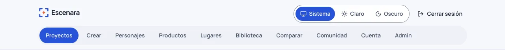

# Primeros pasos: recorrido por el menú

Esta guía es el mapa de la aplicación: qué hay detrás de cada entrada del menú superior, qué viene encendido y qué
hay que encender, y a qué guía ir para cada cosa. Si es tu primera vez, sigue el orden de
[«Por dónde empezar»](#por-dónde-empezar).

Arriba a la derecha están el **selector de tema** (monitor: sistema, sol: claro, luna: oscuro) y **Cerrar sesión**.
Los botones muestran solo iconos; su nombre aparece al pasar el cursor y está disponible para lectores de pantalla.
El enlace **Documentación** abre las guías en otra pestaña. La entrada de la
página en la que estás se ve resaltada. **Admin** solo aparece si tu cuenta tiene rol de administrador.

## Por dónde empezar

1. **Cuenta › Credenciales de IA**: pega tu clave de KIE, guárdala y pulsa «Probar» (no gasta nada). Sin clave no se genera
   nada: Escenara no cobra por la inferencia, la pagas tú con tu proveedor. Lo explica
   [Configurar la API de cada proveedor](configurar-la-api-de-cada-proveedor.md).
2. **Personajes**: crea el tuyo con sus fotos y su consentimiento, o uno **inventado** que no existe
   ([Crear un personaje](crear-un-personaje.md), [Personajes inventados](personajes-inventados.md)).
3. **Crear**: tu primer fotograma y tu primer clip, viendo el coste antes de confirmar
   ([Tu primer vídeo](tu-primer-video.md)).
4. **Proyectos**: cuando quieras un vídeo de varias escenas con guion, producción, revisión y montaje
   ([El asistente de guion](asistente-de-guion.md), [Producir tu proyecto](producir-tu-proyecto.md)).

## Cada entrada del menú

| Entrada | Qué hay | Viene… | Guías |
|---|---|---|---|
| **Proyectos** | Tus vídeos de varias escenas: idea, brief del anuncio, guion, plan con su coste, producción escena a escena, revisión, voz y subtítulos, montaje, historial y gasto, exportar en ZIP y borrar | Encendido. El **asistente de guion** viene apagado (se escribe a mano) | [El asistente de guion](asistente-de-guion.md), [La estrategia del anuncio](estrategia-del-anuncio.md), [Dirigir tu clip](dirigir-tu-clip.md), [Producir tu proyecto](producir-tu-proyecto.md), [Revisar la continuidad](revisar-la-continuidad.md), [Montar y exportar tu vídeo](montaje-y-exportacion.md) |
| **Crear** | Un fotograma y un clip sueltos, paso a paso: formato o trend, personaje, producto, lugar, dirección, coste y resultado. En **Historial** ves lo que has hecho y lo conviertes en proyecto | Encendido. Los **trends** se ven si hay alguno publicado | [Tu primer vídeo](tu-primer-video.md), [Presets y plantillas](presets-y-plantillas.md), [Usar y administrar trends](trends-virales.md), [De Crear a un proyecto](de-crear-a-un-proyecto.md) |
| **Personajes** | Personas y mascotas con sus fotos y su consentimiento, personajes inventados y animados, su ficha, sus versiones y sus vistas | Encendido | [Crear un personaje](crear-un-personaje.md), [Buenas referencias](buenas-referencias.md), [La ficha y las versiones](ficha-y-versiones-de-personaje.md), [Crear un personaje animado](personajes-animados.md) |
| **Productos** | Lo que enseñas delante de la cámara (físico o una app), con sus fotos por papel | Encendido | [Presentar un producto](productos.md) |
| **Lugares** | Un sitio poco conocido que reutilizas como escenario, con su foto maestra, sus versiones y su declaración | Encendido | [Lugares](lugares.md) |
| **Biblioteca** | Todos tus archivos: fotos, audios, música y lo generado, con colecciones y papelera | Encendido | [Crear un personaje](crear-un-personaje.md) (subir y ordenar fotos) |
| **Comparar** | Precios del catálogo, tus resultados y ejemplos de cada modelo, lado a lado. **Aquí no se genera nada**; comparar generando está en la tarjeta de cada escena | Encendido | [Comparar modelos](comparar-modelos.md), [Con qué se genera cada cosa](mapa-de-modelos.md) |
| **Comunidad** | La galería de contenido sintético de la instalación, retos, tus logros y tus publicaciones | **Apagada**: se enciende en Admin › Ajustes › Comunidad | [Comunidad](comunidad.md) |
| **Cuenta** | Perfil, preferencias, credenciales de IA, servicios compatibles con OpenAI, con qué se genera cada cosa, tu kit de marca, contraseña, passkeys, sesiones y **Tus datos** (historial, gasto y borrar la cuenta) | Encendido | [Configurar la API](configurar-la-api-de-cada-proveedor.md), [Tu kit de marca](tu-kit-de-marca.md), [Tus datos](tus-datos.md), [Accesibilidad](accesibilidad.md) |
| **Admin** | El panel de la instalación (solo para administradores) | — | Ver abajo |

## Qué hay que encender en Admin › Ajustes

Casi todo viene listo para usarse. Estas son las opciones que vienen **apagadas** y por qué:

| Opción (sección de Ajustes) | Apagada de fábrica porque… | Guía |
|---|---|---|
| **Encender la comunidad** (Comunidad) | Necesita a alguien que modere, y nada se ve sin aprobación | [Comunidad](comunidad.md) |
| **Asistente de guion activo** (Asistente) | Llama a un modelo de texto de pago; escribir el guion a mano es un camino completo | [El asistente de guion](asistente-de-guion.md) |
| **Traducir los prompts al inglés** (Asistente) | Es una llamada de pago al modelo de texto | [Con qué se genera cada cosa](mapa-de-modelos.md) |
| **Ofrecer canto con audio propio** (Canto) | Está a la espera de una prueba real de pago aprobada | [Cantar con tu audio](cantar-con-audio-propio.md) |
| **Ofrecer la pista de voz aparte** (Voz) | Cuesta créditos por escena; la voz del clip no gasta nada más | [Voz y subtítulos](voz-y-subtitulos.md) |
| **Ofrecer la revisión con modelo** (Revisión) | Cuesta créditos y solo añade una opinión | [Revisar la continuidad](revisar-la-continuidad.md) |

Vienen **encendidos**: el registro de cuentas, los trends vigentes, el brief del anuncio y sus variantes, el podcast y
el dualcast, y el montaje y la exportación (este necesita FFmpeg en el servidor). En la misma página están los
límites de presupuesto, los plazos de **Tus datos** (gracia del borrado, caducidad del ZIP) y el correo.

## El panel de administración

**Admin** abre el panel, con su propio menú en tres grupos:

- **Contenido**: **Medios** (los archivos de la instalación), **Personajes** (revisar el documento de consentimiento
  de un tercero) y **Moderación** (la cola de la comunidad y los retos).
- **Generación**: **Modelos** (catálogo y precios, ver [Dar de alta un modelo](dar-de-alta-un-modelo.md)),
  **Presets**, **Plantillas** (con sus trends y ejemplos, ver [Presets y plantillas](presets-y-plantillas.md)) y
  **Trabajos** (la cola, con un contador de lo que espera revisión).
- **Sistema**: **Ajustes**, **Marca** (nombre, logotipos, tipografía y colores, ver
  [Personaliza tu instancia](personaliza-tu-instancia.md)), **Coherencia**, **Decisiones** y **Calibración** (ver
  [Comprobar la coherencia](comprobar-la-coherencia.md)), **Componentes** (el catálogo de piezas de la interfaz) y
  **Versiones** (el historial de cambios de cada versión).

La primera cuenta que se registra en la instalación es la administradora. Para dar ese rol a otra persona (por
ejemplo, para que modere la comunidad) no hay pantalla todavía: se hace en la base de datos, como explica
[Comunidad](comunidad.md#qué-hace-falta-para-moderar).

## Si algo no te deja seguir

Antes de gastar, cada generación te dice si está **lista**, **necesita ajustes**, **requiere revisión** o está
**bloqueada**, con el motivo y el enlace a donde se arregla. Si no sabes por qué, empieza por
[Por qué no puedo generar](por-que-no-puedo-generar.md).
