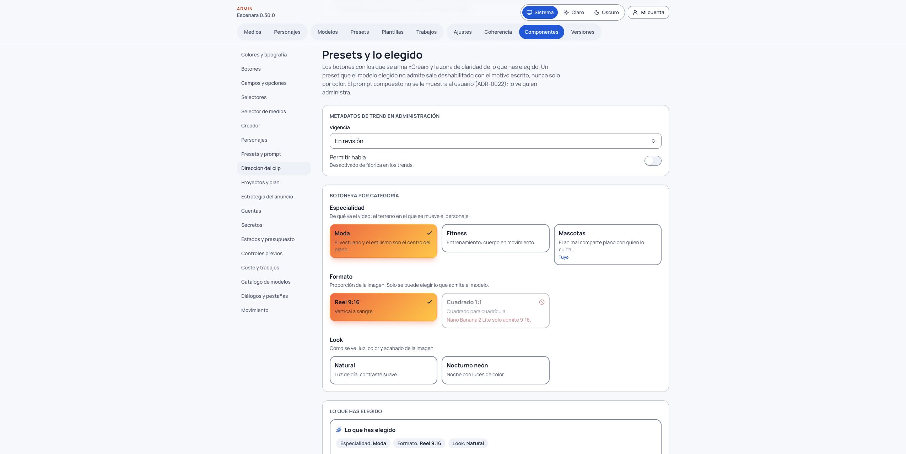

# Usar y administrar trends

Un trend es un formato de clip corto. La tarjeta explica en castellano qué se verá, cuánto dura y si permite diálogo. La plantilla que compone el prompt se guarda en el servidor; la pantalla no muestra su texto interno.

> **Antes de empezar: alguien de administración tiene que publicar un trend.** Solo se pueden elegir los trends
> con vigencia **«Vigente»**, y los que están «En revisión» o «Caducada» no salen. Un administrador los publica en
> **Admin › Plantillas**, abriendo una plantilla de tipo «Trend» y poniendo su **Vigencia** en «Vigente». Mientras no
> haya ninguno publicado, el selector de trends de la escena solo dirá **«Todavía no hay trends aprobados por la
> administración»** y no habrá nada que elegir. Las plantillas iniciales se crean en «En revisión», así que en una
> instalación nueva hay que publicar alguna primero.

## Elegir uno

En **Crear**, elige una imagen de partida y baja hasta el paso del clip. Debajo de la dirección del clip, justo encima del botón de animar, aparece el selector **«Plantilla o trend vigente»**. **Solo aparece si hay al menos un trend publicado**: sin ninguno, el paso del clip no muestra ese selector y no verás nada de trends. Elige un trend, revisa su vista previa y los campos que pide. La duración se fija a la de ese formato y Escenara vuelve a pedir al servidor la estimación del modelo. El resumen de coste muestra créditos, fecha del precio, posibles costes de traducción y el total exacto que hay que confirmar.

En un **proyecto**, abre una escena: debajo de su dirección está la sección **«Trend del clip»** con el selector «Formato vigente» (no aparece si el formato de la escena es cantar). Si no hay trends publicados, solo ofrece «Sin trend». Solo se pueden elegir formatos cuya duración coincide con la del proyecto. El plan vuelve a mostrar y a confirmar el coste antes de producir. Si el formato no permite habla, el guion no entra en el prompt del clip; puedes poner la voz en off más adelante. Si eliges un producto, se pide como parte de la escena y se aplican sus avisos y la comprobación de fidelidad.

Si un trend caduca entre la elección y la confirmación, el servidor bloquea la generación sin reservar créditos. El mensaje señala la copia vigente equivalente cuando existe. Vuelve a elegirla y revisa otra vez el coste. Si el modelo de vídeo no admite la foto del producto como referencia, la pantalla avisa de que la etiqueta puede variar y pide confirmar el aviso antes de animar. El fotograma puede reutilizarse tras un fallo del clip si autorizas el reintento; al cambiar la escena o el modelo, revisa si hace falta un nuevo fotograma.

## Dar de alta y mantener uno

Quien administra abre **Admin › Plantillas**, crea una plantilla de tipo «Trend» y define nombre y descripción en castellano, texto de composición y variables, plataforma de referencia, duración objetivo, si permite habla y motivo de la versión. La referencia informativa del admin debe ser una URL HTTPS sin credenciales. Guarda primero en **revisión** y comprueba la vista del catálogo de componentes. La edición del texto, las variables o el permiso de habla crea otra versión y conserva las anteriores para los trabajos ya hechos.

Después de una prueba real aprobada por el propietario, puede poner la plantilla **vigente**. Cuando el formato envejezca, usa «Caducar trend». Una caducada no se edita ni genera: se duplica, se revisa la nueva versión y se publica cuando corresponda. El interruptor de **Admin › Ajustes** oculta todos los trends sin desplegar.

Las cinco plantillas iniciales se crearon en **revisión**. Para la prueba se activaron unboxing y giro a 6 s; al fallar Hailuo sin cobro, se duplicaron en variantes de 5 s con MiniMax H3. Tras generar los ejemplos, ambas versiones volvieron a **revisión** hasta que el propietario valore su calidad y decida publicarlas. La cuenta de administración conserva el [proyecto de prueba de dos trends](/proyectos/4fb19dba-589e-4a90-b3b6-18fe19ee3479), los fallos, los clips terminados y el MP4. La [guía de recorridos](recorridos-de-referencia-0.29-0.32.md) documenta los costes y los límites visuales observados; los otros tres formatos tampoco se han publicado.
